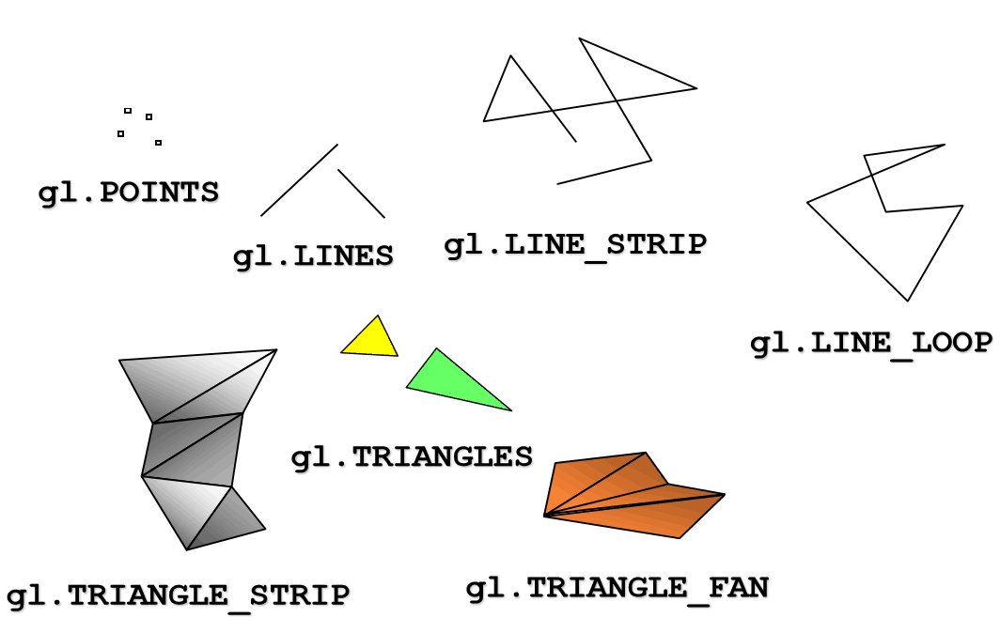

### webGL 的 代码实现流程


### 渲染场景

虽然我们的例子只是画一个二维物体，但我们仍然是在把它**画在一个三维空间里**。所以，我们依然需要创建着色器，通过它来渲染我们的简单场景并画出我们的物体。

> **顶点着色器**
>
> **1.gl_Position**
> 每次渲染一个形状时，顶点着色器会在形状中的每个顶点运行。 它的工作是将**输入顶点从原始坐标系转换到WebGL使用的缩放空间(clipspace)坐标系**，其中每个轴的坐标范围从-1.0到1.0，并且不考虑纵横比，实际尺寸或任何其他因素。
> 顶点着色器需要**对顶点坐标进行必要的转换**，在每个顶点基础上进行其他调整或计算，然后通过将其**保存**在由GLSL提供的**特殊变量（我们称为gl_Position）中来返回变换后的顶点**
> **2.纹理坐标、atrributes、varyings、uniform**
> 
>

> **片段着色器**
>
> **1.gl_FragColor**
> **片段着色器**在顶点着色器处理完图形的顶点后，会被要绘制的每个图形的每个像素点调用一次。它的职责是确定像素的颜色，通过指定应用到像素的纹理元素（也就是图形纹理中的像素），获取纹理元素的颜色，然后将适当的光照应用于颜色。之后颜色存储在特殊变量**gl_FragColor**中，返回到WebGL层。该颜色将最终绘制到屏幕上图形对应像素的对应位置。

### 创建对象

在画正方形前，我们需要创建一个缓冲器来存储它的顶点。我们会用到名字为 initBuffers() 的函数。当我们了解到更多WebGL 的高级概念时，这段代码会将有更多参数，变得更加复杂，并且用来创建更多的三维物体。

首先，它调用 gl 的成员函数 [`createBuffer()`](https://developer.mozilla.org/zh-CN/docs/Web/API/WebGLRenderingContext/createBuffer) 得到了缓冲对象并存储在顶点缓冲器。然后调用 [`bindBuffer()`](https://developer.mozilla.org/zh-CN/docs/Web/API/WebGLRenderingContext/bindBuffer) 函数绑定上下文。

当上一步完成，我们创建一个Javascript 数组去记录每一个正方体的每一个顶点。然后将其转化为 WebGL 浮点型类型的数组，并将其传到 gl 对象的  [`bufferData()`](https://developer.mozilla.org/zh-CN/docs/Web/API/WebGLRenderingContext/bufferData) 方法来建立对象的顶点。

### 绘制场景

```js
function drawScene(gl, programInfo, buffers) {
  gl.clearColor(0.0, 0.0, 0.0, 1.0);  // Clear to black, fully opaque
  gl.clearDepth(1.0);                 // Clear everything
  gl.enable(gl.DEPTH_TEST);           // Enable depth testing
  gl.depthFunc(gl.LEQUAL);            // Near things obscure far things

  // Clear the canvas before we start drawing on it.

  gl.clear(gl.COLOR_BUFFER_BIT | gl.DEPTH_BUFFER_BIT);

  // Create a perspective matrix, a special matrix that is
  // used to simulate the distortion of perspective in a camera.
  // Our field of view is 45 degrees, with a width/height
  // ratio that matches the display size of the canvas
  // and we only want to see objects between 0.1 units
  // and 100 units away from the camera.

  const fieldOfView = 45 * Math.PI / 180;   // in radians
  const aspect = gl.canvas.clientWidth / gl.canvas.clientHeight;
  const zNear = 0.1;
  const zFar = 100.0;
  const projectionMatrix = mat4.create();

  // note: glmatrix.js always has the first argument
  // as the destination to receive the result.
  mat4.perspective(projectionMatrix,
                   fieldOfView,
                   aspect,
                   zNear,
                   zFar);

  // Set the drawing position to the "identity" point, which is
  // the center of the scene.
  const modelViewMatrix = mat4.create();

  // Now move the drawing position a bit to where we want to
  // start drawing the square.

  mat4.translate(modelViewMatrix,     // destination matrix
                 modelViewMatrix,     // matrix to translate
                 [-0.0, 0.0, -6.0]);  // amount to translate

  // Tell WebGL how to pull out the positions from the position
  // buffer into the vertexPosition attribute.
  {
    const numComponents = 2;  // pull out 2 values per iteration
    const type = gl.FLOAT;    // the data in the buffer is 32bit floats
    const normalize = false;  // don't normalize
    const stride = 0;         // how many bytes to get from one set of values to the next
                              // 0 = use type and numComponents above
    const offset = 0;         // how many bytes inside the buffer to start from
    gl.bindBuffer(gl.ARRAY_BUFFER, buffers.position);
    gl.vertexAttribPointer(
        programInfo.attribLocations.vertexPosition,
        numComponents,
        type,
        normalize,
        stride,
        offset);
    gl.enableVertexAttribArray(
        programInfo.attribLocations.vertexPosition);
  }

  // Tell WebGL to use our program when drawing

  gl.useProgram(programInfo.program);

  // Set the shader uniforms

  gl.uniformMatrix4fv(
      programInfo.uniformLocations.projectionMatrix,
      false,
      projectionMatrix);
  gl.uniformMatrix4fv(
      programInfo.uniformLocations.modelViewMatrix,
      false,
      modelViewMatrix);

  {
    const offset = 0;
    const vertexCount = 4;
    gl.drawArrays(gl.TRIANGLE_STRIP, offset, vertexCount);
  }
}
```

### 着色器颜色

创建colorbuffer 、 attribute aVertexcolor 、 varying vColor 、gl_FragColor = vColor



#### 空间

https://blog.csdn.net/ad88282284/article/details/78245719

