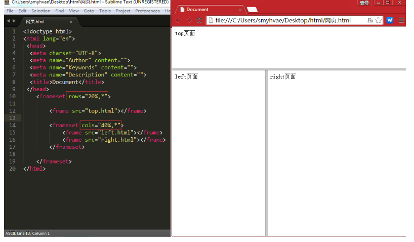
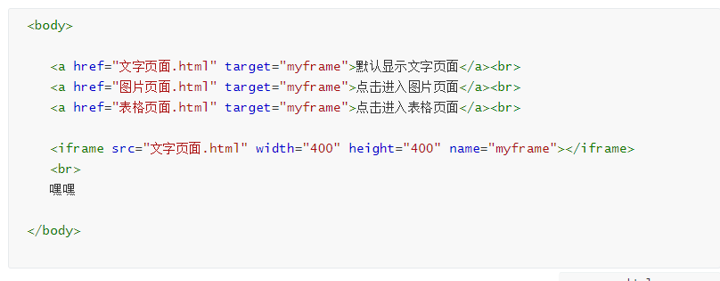
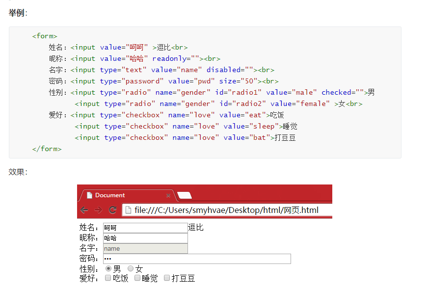
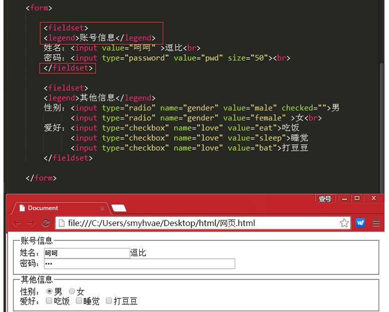

html
HTML是负责描述文档语义的语言
中国公司  都是汉语， 极致速度 用 GB2312 不行就UTF-8
html:5 tab

```html
<meta http-equiv="refresh" content="3;http://www.baidu.com"> 3s后跳转
<meta name="viewport" content="width=device-width, initial-scale=1.0">
<meta name="Keywords" content="网易,邮箱,游戏,新闻,体育,娱乐,女性,亚运,论坛,短信" />
<meta name="Description" content="网易是中国领先的互联网技术公司，为用户提供免费邮箱、游戏、搜索引擎服务，开设新闻、娱乐、体育等30多个内容频道，及博客、视频、论坛等互动交流，网聚人的力量。" />
<base href="/">
文本级标签：p、span、a、b、i、u、em。文本级标签里只能放文字、图片、表单元素。（a标签里不能放a和input）
容器级标签：div、h系列、li、dt、dd。容器级标签里可以放置任何东西。
<span>是不换行的,文本级，而<div>是换行的，容器级
<br /> <hr />
<center> </center> 
<pre> </pre>
<font face="微软雅黑" color="#FF0000" size+"10"> </font>
&nbsp;、&lt;、&gt;、&copy;
<u>  <s>或<del> <i>或<em> <b> <sup> <sub> 
内部跳转 设置<a name="xx"> /  <a href ="#xx">
<a href="mailto:smyhvae@163.com">点击进入我的邮箱</a>
a 的属性 targert _blank _self  文本级标签
  没有终止  。alt= 代表替换资源 ， align 代表与附近文字的对齐
width \ height\ Align \ title\ name \class\ id 基本都有
<ul>
    <li>    type="disc" square  circle
<dl> <dt> <dd>
<table>   表格
    <caption align="center">这是表格的标题</caption>  
    <tr>  换行
        <td colspan="2"></td>   项目
        <td rowspan="2"></td>   colspan 横向合并 rowspan 纵向合并 
        <th>  加粗单元格
    </tr>
</table>
如果用thead、tbody、tfoot标签的话，那么**数据可以边获取边显示**。如果用td，则必须等表格的内容全部从服务器获取完成才能显示出来
框架标签
 <frameset>  rows, cols
```





**表单 <form>**

name, id, action,method

**Enctype：**
表单数据的编码方式(加密方式)，取值可以是：application/x-www-form-urlencoded、multipart/form-data。Enctype只能在POST方式下使用。

- Application/x-www-form-urlencoded：**默认**加密方式，除了上传文件之外的数据都可以
- Multipart/form-data：**上传附件时，必须使用这种编码方式**。

**输入标签<input>**

<input type="text" />

* type = "text"\ password\radio\checkbox\checked\hidden\button\submit\reset\imge\file
* value  默认
* size="50"  允许输入的字符
* readonly  只读
* disabled  制度
* 

**下拉列表标签<select>**

* multiple
* size="3"  为1 则为下拉视图， 大于1 就是滚动选择视图

**属性标签<option>**

* selected： 预选中

**多行文本输入框<textare>**

* value 
* rows="4"
* cols="20"
* readonly

**表单语义化**

主要为fieldset 和 legend 使用

r

让上面图片的人点击男女标签也可以点到， 用**label**标签包裹起来

(任何单元素都有label)

<input type="radio" name="sex" id="nan" /> <label for="nan">男</label>

背景音乐 

​	<bgsound src="王菲 - 清风徐来.mp3"></bgsound>

播放多媒体文件

<video>