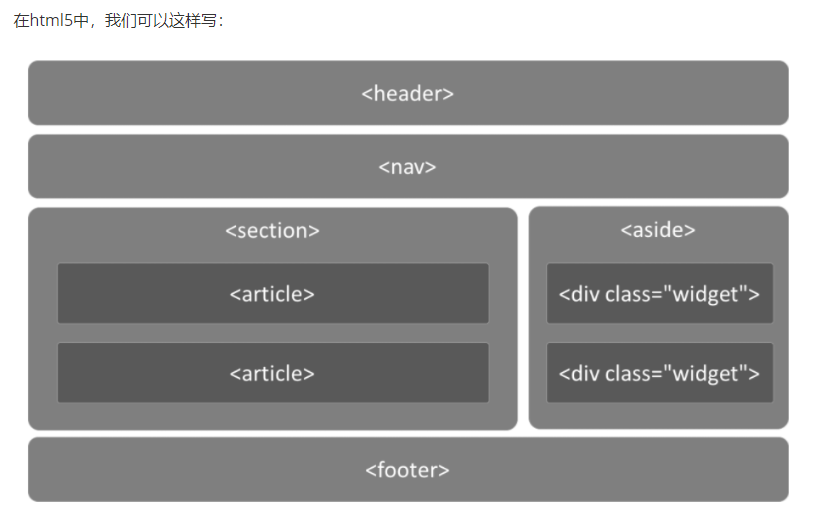

**H5 的经典网页布局：**

```html
<!-- 头部 -->
<header>
    <ul class="nav"></ul>
</header>

<!-- 主体部分 -->
<div class="main">
    <!-- 文章 -->
    <article></article>
    <!-- 侧边栏 -->
    <aside></aside>
</div>

<!-- 底部 -->
<footer>

</footer>
```

ie8以下解决方案，加载第三方js库

    <!--  条件注释 只有ie能够识别-->
    
    <!--[if lte ie 8]>
        <script src="html5shiv.min.js"></script>
    <![endif]-->
form表单

