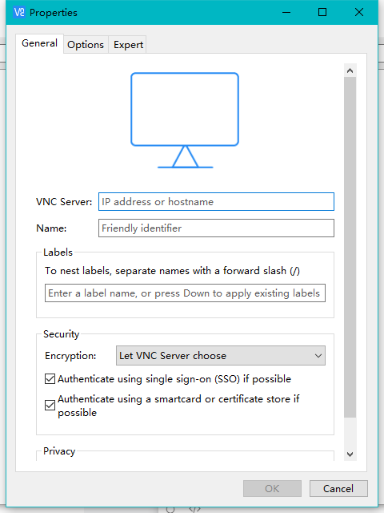
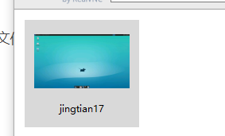
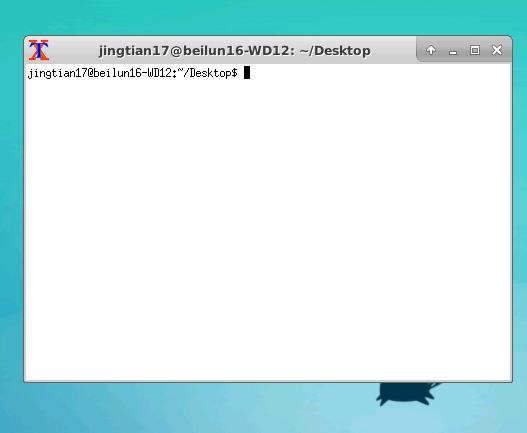

1. 安装 vnc4server 

   ```
   sudo apt-get install vnc4server
   ```

2. 安装xfce4

   ```
    sudo apt-ge install xfce4
   ```

3. 配置 ./vnc/xstartup文件 为

   ```
   #!/bin/sh
   # Uncomment the following two lines for normal desktop:
   # unset SESSION_MANAGER
   # exec /etc/X11/xinit/xinitrc
   [ -x /etc/vnc/xstartup ] && exec /etc/vnc/xstartup
   [ -r $HOME/.Xresources ] && xrdb $HOME/.Xresources
   xsetroot -solid grey
   vncconfig -iconic &
   x-terminal-emulator -geometry 80x24+10+10 -ls -title "$VNCDESKTOP Desktop" &
   #x-window-manager &
   sesion-manager & xfdesktop & xfce4-panel &
   xfce4-menu-plugin &
   xfsettingsd &
   xfconfd &
   xfwm4 &
   ```

4. 安装xterm    sudo apt install xterm

5. sudo update-alternatives --config x-terminal-emulator，选择/usr/bin/xterm项
   4.5.步为了打开图形界面能够启动终端

6. vncserver  :1 -geometry 1902x1080  后面可选 

7. vncserver -kill :1

8. windows 方面 下载VNC Viewer

9. 

VNC Server :  ip地址:1  1为实际用的VNC号码

Name  随便自己创就行



Application - settings - setting manager-  perferred applications 设置使用的终端  

最终得到效果

