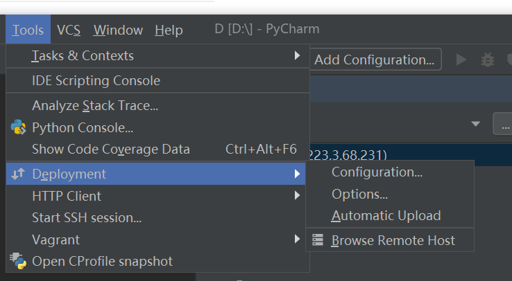

# 如何优雅地Remote

@Auther Oanakiaja Zhang

@github Oanakiaja

---

# 自己搞，（你们别搞，到时候弄冲突了，我懒得弄，讲的能用就行，下面是给你们想学学咋个完整自己弄的看的）

### **1.工具准备：**

​	method 1 :  vscode + Remote SSH ( SSH 要优雅的话需要把服务器公钥给服务器，否则一直叫输入密码很烦)

##### 	method 2 : pycharm remote + filezilla + jupyter notebook  +  nohup &  后台运行


### 2.配置:

​	method2 是我常用的方法: 个人觉得pycharm很适合大一点的python项目

   1. 下载filezilla 自己找嗷，都是学计算机的人了嗷

   2. pycharm 自己下嗷，下专业版，别下社区版，否则没得remote， 东大邮箱可认证全家桶

   3. jupyter notebook 自己找嗷 ， 用清华conda镜像吧

   4. supervisor 自己下嗷 配置给你贴一下就明白了 (**这步骤可以先不管，等熟了再说)**

   5. pycharm remote 

      


然后你就test 一下 connection完事， 自己拿了寝室里面宽带上不了别怪服务器炸了嗷，上学校的vpn

然后你在navigator栏的Tools里面点start ssh session 就有一个远程的bash来了嗷

（ 之后你想怎么干就怎么干）  （逃）

（误）

### 如何爽到？ 一次配置，永久快乐

* **爽点1** ：本地写代码，远程跑代码

  * 开爽

  * 

    

    把本地的要用的环境的python放到interpreter上面去，第二个就是你同步的文件夹

    本地改了 远程开爽

    我习惯用远程python 命令行，因为之后你们可能会接触一个叫做 `optParser` 的python包，用命令行带参数的，深度学习训练就经常用这个了.

    

* **爽点2**： 本地开jupyter，放后台，想开就开

**服务器上**

```
jupyter notebook
```

但是如果你这么做，关闭终端就没了

（见环境不对bug ， 本文最后）

所以我们有进阶方法1 :

```
nohup jupyter notebook &
```

这么你可以在按了命令的目录下面看到一个 `nohup.out ` 文件

自己学学vi (vim (误，我懒得下,两个差不多))  ，记不到就网上查

`vi nohup.out` 

可以把地址拷贝到本地，以后直接用就行。

---

**自己电脑**

开命令行(管你是cmd 还是 powershell)

```
ssh -N -L localhost:8888:loaclhost:8888 jingtian17@223.3.68.231
```

输入密码就完事了

上面8889你看上面`.out`上的http上带的是啥端口，其他反正什么账号的按着改

我怕大家会端口打架，反正你们按着来吧（ 打架就打架，反正暂时没人在jupyter上面跑代码）


```
          http://localhost:8888/?token=3df6a508b597e670693030f1905929fee29210e8bbb24156
```

按着来就行

#### bug：自己把自己搞笑了

把jupyter下载conda的base环境里面，用其他的环境 nohup 就不可以

