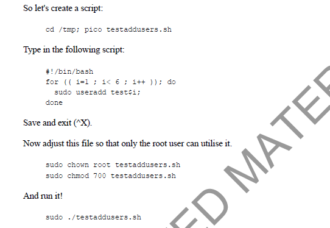
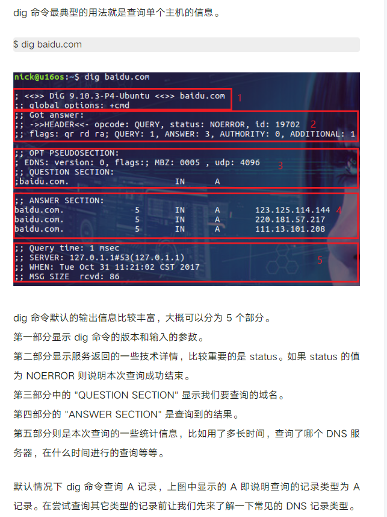

## 2019

### 0  记录此文档之前的事情

1. #### 无法在这个大型工作区中监视文件更改。请按照说明链接来解决此问题。

http://www.deadnine.com/somehow/2019/0208/1481.html

kill -s -9 pid号

ps aux| grep 想杀死进程

yum rpm包管理工具

**ssh:notty**：被黑客暴力破解ssh

https://blog.csdn.net/gammey/article/details/80404375

lastb

#### 1.conda 没法找到

安装好了anaconda但是没办法用conda命令怎么办.

```cmd
step1: 查看环境变量 
env
step2: 添加环境变量
export PATH=$PATH:/home/jingtian17/anaconda3
用户名改成自己的 
step3: 设置永久有效
source ~/.bashrc
如果不退出，这次设置的环境变量退出bash就没了
```

#### 2.jupyter 使用

```cmd
step1: 复制 url 到本机浏览器
jupyter notebook   

step2:本机
ssh -N -L localhost:xxxx:localhost:xxxx username@223.3.89.188
```

#### 3.安装pytorch

```cmd
conda install pytorch torchvision cudatoolkit=10.0 -c pytorch
```

#### 4. 删除环境变量

https://www.cnblogs.com/zhangwuji/p/7899075.html

#### 5. Ubuntu下~/.bashrc文件的恢复方法

##### 问题描述

如果不小心在更改环境变量文件`~/.bashrc`时出现将文件内容覆盖的情况，比如`echo hello world > ~/.bashrc`没有使用添加模式而是覆盖模式． 
**NOTE：非覆盖情况下，不推荐本文的方法．**

##### 解决方案

用系统中存储的`.bashrc`备份文件恢复到`~/`目录下，执行：

```
cp  /etc/skel/.bashrc   ~/1
```

其中，`/etc/skel`是Ubuntu的各种初始配置文件的存放目录.

### 9月

#### 1.conda 换源

vim ~/.condarc

```
channels:
  - defaults
show_channel_urls: true
default_channels:
  - https://mirrors.tuna.tsinghua.edu.cn/anaconda/pkgs/main
  - https://mirrors.tuna.tsinghua.edu.cn/anaconda/pkgs/r
custom_channels:
  conda-forge: https://mirrors.tuna.tsinghua.edu.cn/anaconda/cloud
  msys2: https://mirrors.tuna.tsinghua.edu.cn/anaconda/cloud
  bioconda: https://mirrors.tuna.tsinghua.edu.cn/anaconda/cloud
  menpo: https://mirrors.tuna.tsinghua.edu.cn/anaconda/cloud
  pytorch: https://mirrors.tuna.tsinghua.edu.cn/anaconda/cloud
```

​	详见清华大学TUNA景镜像站

#### 2.vi 删除所有

命令为：`ggdG`

其中，gg为跳转到文件首行；dG为删除光标所在行以及其下所有行的内容；

再细讲，d为删除，G为跳转到文件末尾行；

#### 3. 前后台运行

**不挂断后台运行**

`nohup ./text &`

**查看前后台运行进程**

`jobs` : 查看当前终端后台运行的任务, 

`jobs -l`: (显示PID等信息)   （+：表示当前任务    - ：表示后一个任务）

`ps` : ` ps -aux|grep pid 端口号`  a:（all）显示所有进程    u ：以用户为主的格式     x : 所有的进程不以终端区分。

`lsof -i:端口号` 

`ps -aux/ef | grep 服务名称`

 **结束进程**            

`kill -9 % PID（or jobnum）` 

 **前后台进程的切换和控制**

`fg % PID（or jobnum）`

`bg % PID（or jobnum）:将后台暂停的进程，运行起来。`

#### 4.conda命令

**查看环境**

`conda info -e`

#### 5.pytorch 使用不同版本的cuda

https://www.cnblogs.com/yhjoker/p/10972795.html

#### 6. deb 安装

dpkg -i 安装包名字


### 12月

此月都是关于**网络运维**方面，为什么？ 因为上了门课，讲网络运维的linux


#### 1.LAMP (linux + Apache + MySQL + PHP/Perl/Python)

```
sudo apt update
sudo apt upgrade 
sudo apt install lamp-server^
```

#### 2.man

manual 查看指令的含义

```
man [section number] [命令名称]
```


man关键字查询

```
man -k user  
```

#### 3. users and groups

添加、删除用户

```
sudo useradd testuser
sudo userdel testuser
```



执行sh文件的时候， 注意给 chmod +x 加权限直接运行

添加组

```
sudo addgroup shark
sudo usermod -a -G shark test3
```


/etc/passwd

/etc/group


#### 4.head、tail、less 、more、cat、grep

都是查看文本的方法

Linux more 命令类似 cat ，不过会以一页一页的形式显示，更方便使用者逐页阅读，而最基本的指令就是按空白键（space）就往下一页显示，按 b 键就会往回（back）一页显示，而且还有搜寻字串的功能（与 vi 相似），使用中的说明文件，请按 h 。

#### 5. crontab

定时器

编辑 

```
crontab -u oana -e

* * * * * grep xxxxxx 命令
分时日月周
```

list cron jobs

```
crontab -u oana -l
```


#### 6.ifconfig

查看网络信息

#### 7. chown \ chmod

 归属组 和 赋予权限

#### 8.tr

```
tr l L < /etc/hosts
```

临时把 /etc/hosts 中的小写字母换成大写

#### 9. <   >  >>  |

```
< 引入
> 覆盖
>> 追加
| 管道
```


#### 10. time zone

查看时间

```
date
```

查看时区

```
more /etc/timezone
```

查看可用时区

```
timedatectl list-timezones
```

设置时区

```
sudo timedatectl set-timezone Asia/Shanghai
```

查看system time  status

```
timedatectl status
```

查看远程linux 的status

```
timedatectl -H oana@desktopIp status
```

cron

```
sudo service cron restart
```

#### 11.arp 协议 和抓包

arp 协议

```
arp
```

 通过ip地址存储 MAC 地址的 cache


删除 cache

```
arp -d ipnumber
```

tcpdump ctl抓包

命令行抓包工具

```
sudo tcpdump -c 4 "icmp or arp" -q
```

然后在其他电脑上 ping 就可以抓到了

详情自己学习 tcpdump

wireshark 抓包

wireshark如果要获得所有的interface

```																																																																																																																				
sudo wireshark &
```

& 是把GUI放在最前面

#### 12. ip 设置

图形界面，网络上手动设置


```/var/log/apache2/access.log``` 为 dokuwiki 的get、post 的log

**wc -l**

```
grep "GET /dokuwiki" access.log | wc-l
```

#### 13. 设置硬件时钟和系统时钟一致

ntp server

#### 14. 获得字段的piece

**awk -F[符号]  '{print $1 , \$3}'**

```
grep ^[aeiou] /etc/passwd | awk -F: '{print $1, $3}' | sort -u
```

#### 15. sort -u 

按照字典正序排序

#### 16.logger [options] [messages]

直接控制 /var/log/syslog 文件 

log --tag tag messages

#### 17.DNS server

**bind 服务**

配置的文件在 `/etc/bind/`文件夹下

在named.conf 上搞域名


**dig 命令**

dig 命令 主要用来从DNS域名服务器查询主机地址信息 

```
$ dig baidu.com
```

```
$ dig abc.filterinto.com CNAME
```
由于一些原因，希望从指定的 DNS 服务器上进行查询(从默认的 DNS 服务器上获得的结果可能不准确)。指定 DNS 服务器的方式为使用 @ 符号：
如果不指定 DNS 服务器，dig 会依次使用 /etc/resolv.conf 里的地址作为 DNS 服务器：

```
$ dig @8.8.8.8 abc.filterinto.com
```

在前面的查询中我们指定了查询服务器为 8.8.8.8，这是谁家的 DNS 服务器？其实我们可以使用 dig 的 -x 选项来反向解析 IP 地址对应的域名：

```
$ dig -x 8.8.8.8 +short
```

dig 命令默认返回的结果展示详细的信息，如果要获得精简的结果可以使用 +short 选项：

```
$ dig +short abc.filterinto.com
```

如果你好奇 dig 命令执行查询时都经历了哪些过程，你可以尝试使用 +trace 选项。它会输出从根域到最终结果的所有信息：

```
$ dig +trace abc.filterinto.com
```




#### 18. ipserver

**netplan**  apply the new network config


#### 19. RAID5 

`lsblk -o NAME,SIZE,FSTYPE,TYPE,MOUNTPOIT`

获取所有块设备信息, 查看硬盘在文件系统的情况

软RAID指令

**mdadm**

`mdadm --create --verbose /dev/md0 --level=5 --raid-devices=3 /dev/sd{b,c,d}`

`/dev/md0` 指定的块设备文件，后面用来挂载

`mdadm --detail --scan ` 扫描配置文件

**mkfs.ext4**

`sudo mkfs.ext4 /dev/md0` 格式化硬盘

**df -h**

**tee  -a  filepath** 重定向输出到某文件

`sudo update-initramfs -u` 更新内核

`/etc/fstab`

磁盘被手动挂载之后都必须把挂载信息写入/etc/fstab这个文件中，否则下次开机启动时仍然需要重新挂载。

**挂载**

当在 Linux 系统中使用这些硬件设备时，只有将Linux本身的文件目录与硬件设备的文件目录合二为一，硬件设备才能为我们所用。合二为一的过程称为“挂载”。