# 动手学习深度学习笔记

@ author : Oanakiaja

## 1.numpy

| func_name                                       | func_use | func_exam                                            |
| ----------------------------------------------- | -------- | ---------------------------------------------------- |
| `numpy.random.normal(mean,variance,shape(h,w))` | 正态     | `numpy.random.normal(0,1,(num_samples, num_inputs))` |
|                                                 |          |                                                      |


## 2.matplotlib

| func_name | func_use | func_exam |
| --------- | -------- | --------- |
|           |          |           |
|           |          |           |

## 3.pytorch

### 3.1(以线性回归为例子)总训练步骤:

:one: 读取数据(batch_size\预处理数据)

:two: 初始化模型(定义模型\模型参数设定)

:three: 定义损失函数

:four: 定义优化算法

自动求梯度模块计算得来的梯度是一个批量样本的梯度和。我们将它除以批量大小来得到平均值。

```python
def sgd(params, lr, batch_size):  # 本函数已保存在d2lzh_pytorch包中方便以后使用
    for param in params:
        param.data -= lr * param.grad / batch_size # 注意这里更改param时用的param.data
```

:five: 训练模型

参数设置:

```python
lr = 0.03
num_epochs = 3
net = linreg
loss = squared_loss
```

```python
for epoch in range(num_epochs):  # 训练模型一共需要num_epochs个迭代周期
    # 在每一个迭代周期中，会使用训练数据集中所有样本一次（假设样本数能够被批量大小整除）。X
    # 和y分别是小批量样本的特征和标签
    for X, y in data_iter(batch_size, features, labels):
        l = loss(net(X, w, b), y).sum()  # l是有关小批量X和y的损失
        l.backward()  # 小批量的损失对模型参数求梯度
        sgd([w, b], lr, batch_size)  # 使用小批量随机梯度下降迭代模型参数
        
        # 不要忘了梯度清零
        w.grad.data.zero_()
        b.grad.data.zero_()
    train_l = loss(net(features, w, b), labels)
    print('epoch %d, loss %f' % (epoch + 1, train_l.mean().item()))
```

* epoch 是训练整个数据集的批次，每一次输出一次loss 看一看
* batch 是同一个数据集的求loss更新的一次批次，每次更新一次参数梯度，换一个batch，多个batch为一个epoch

### 3.3.2 Pytorch  简洁实现

#### 3.3.2.1 torch.utils.data

```python
import torch.utils.data as Data

batch_size = 10
# 将训练数据的特征和标签组合
dataset = Data.TensorDataset(features, labels)
# 随机读取小批量
data_iter = Data.DataLoader(dataset, batch_size, shuffle=True)
for X, y in data_iter:
    print(X, y)
    break
```

#### 3.3.2.2 torch.nn

:one: nn.Module

```python
class LinearNet(nn.Module):
    def __init__(self, n_feature):
        super(LinearNet, self).__init__()
        self.linear = nn.Linear(n_feature, 1)
    # forward 定义前向传播
    def forward(self, x):
        y = self.linear(x)
        return y
    
net = LinearNet(num_inputs)
print(net) # 使用print可以打印出网络的结构

# 可以通过`net.parameters()`来查看模型所有的可学习参数，此函数将返回一个生成器。
for param in net.parameters():
    print(param)
```

> 注意：`torch.nn`仅支持输入一个batch的样本不支持单个样本输入，如果只有单个样本，可使用`input.unsqueeze(0)`来添加一维。

:two: nn.init

```python
from torch.nn import init

init.normal_(net[0].weight, mean=0, std=0.01)
init.constant_(net[0].bias, val=0)  # 也可以直接修改bias的data: net[0].bias.data.fill_(0)
```

:three: nn.MSELoss()

```python
loss = nn.MSELoss()
```

#### 3.3.2.3 torch.optim

```python
import torch.optim as optim

# 常用办法
optimizer = optim.SGD(net.parameters(), lr=0.03)
# 高级设置
optimizer =optim.SGD([
                # 如果对某个参数不指定学习率，就使用最外层的默认学习率
                {'params': net.subnet1.parameters()}, # lr=0.03
                {'params': net.subnet2.parameters(), 'lr': 0.01}
            ], lr=0.03)
# 调整学习率
for param_group in optimizer.param_groups:
    param_group['lr'] *= 0.1 # 学习率为之前的0.1倍

```

#### 3.3.2.4 训练模型

 ```python
num_epochs = 3
for epoch in range(1, num_epochs + 1):
    for X, y in data_iter:
        output = net(X)
        l = loss(output, y.view(-1, 1))
        optimizer.zero_grad() # 梯度清零，等价于net.zero_grad()
        l.backward()
        optimizer.step()
    print('epoch %d, loss: %f' % (epoch, l.item()))
 ```

#### 3.3.3 torchvision

torchvision.datasets

torchvision.models

torchvision.transforms

torchvision.utils

>**如果用像素值(0-255整数)表示图片数据，那么一律将其类型设置成uint8，避免不必要的bug**

| func_name                                         | func_use                                  | func_exam |
| ------------------------------------------------- | ----------------------------------------- | --------- |
| torch.mm(X,w)                                     | 矩阵dot                                   |           |
| .backward()                                       | 求梯度                                    |           |
| .grad.data_zero_()                                | 设置某变量梯度为                          |           |
| optimizer.zero_grad()                             | 设置optimizer的梯度为0                    |           |
| Data.TensorDataset(Features, Labels)              | 创建数据集                                |           |
| Data.Dataloader(dataset, batch_size,shuffle=True) | 数据生成器                                |           |
| init.normal_(net.para, mean , std)                | 初始化参数为normal                        |           |
| init.normal_(net.para, val)                       | 初始化参数为val                           |           |
| nn.MESLoss()                                      |                                           |           |
| torch.stack()                                     | 堆叠，部分行重叠, 一般多卷积核用,堆成一起 |           |
| torch.cat((x,y), dim =0 )                         | 按行拼接                                  |           |
| torch.transpose()                                 | 交换维度                                  |           |
| torch.permute()                                   |                                           |           |
| x.squeeze(dim_n)                                  |                                           |           |
| x.unsqueeze(dim_n)                                |                                           |           |


### 3.3 模型构造

### 3.4 Convolutional  卷积

#### 3.4.1 二维卷积层

我们用一个具体例子来解释二维互相关运算的含义。如图5.1所示，输入是一个高和宽均为3的二维数组。我们将该数组的形状记为$3 \times 3$或（3，3）。核数组的高和宽分别为2。该数组在卷积计算中又称卷积核或过滤器（filter）。卷积核窗口（又称卷积窗口）的形状取决于卷积核的高和宽，即$2 \times 2$。图5.1中的阴影部分为第一个输出元素及其计算所使用的输入和核数组元素：$0\times0+1\times1+3\times2+4\times3=19$。

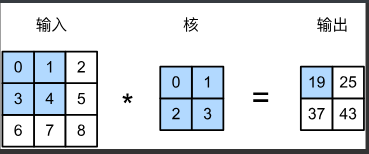

在二维互相关运算中，卷积窗口从输入数组的最左上方开始，按从左往右、从上往下的顺序，依次在输入数组上滑动。当卷积窗口滑动到某一位置时，窗口中的输入子数组与核数组按元素相乘并求和，得到输出数组中相应位置的元素。

**卷积网络的迭代理解**

二维卷积层将输入和卷积核做互相关运算，并加上一个标量偏差来得到输出。卷积层的模型参数包括了卷积核和标量偏差。**在训练模型的时候，通常我们先对卷积核随机初始化，然后不断迭代卷积核和偏差。**

**二维卷积层代码**

```python
class Conv2D(nn.Module):
    def __init__(self, kernel_size):
        super(Conv2D, self).__init__()
        self.weight = nn.Parameter(torch.randn(kernel_size))
        self.bias = nn.Parameter(torch.randn(1))

    def forward(self, x):
        return corr2d(x, self.weight) + self.bias
```

####  3.4.2 特征图和感受野

二维卷积层输出的二维数组可以看作是输入在空间维度（宽和高）上某一级的表征，也叫特征图（feature map）。影响元素$x$的前向计算的所有可能输入区域（可能大于输入的实际尺寸）叫做$x$的感受野（receptive field）。以本节开始的图为例，输入中阴影部分的四个元素是输出中阴影部分元素的感受野。我们将图5.1中形状为$2 \times 2$的输出记为$Y$，并考虑一个更深的卷积神经网络：将$Y$与另一个形状为$2 \times 2$的核数组做互相关运算，输出单个元素$z$。那么，$z$在$Y$上的感受野包括$Y$的全部四个元素，在输入上的感受野包括其中全部9个元素。可见，我们可以**通过更深的卷积神经网络使特征图中单个元素的感受野变得更加广阔，从而捕捉输入上更大尺寸的特征。**

#### 3.4.3 填充和步幅

**填充padding**

填充（padding）是指在输入高和宽的两侧填充元素（通常是0元素）。图5.2里我们在原输入高和宽的两侧分别添加了值为0的元素，使得输入高和宽从3变成了5，并导致输出高和宽由2增加到4。图5.2中的阴影部分为第一个输出元素及其计算所使用的输入和核数组元素：$0\times0+0\times1+0\times2+0\times3=0$。

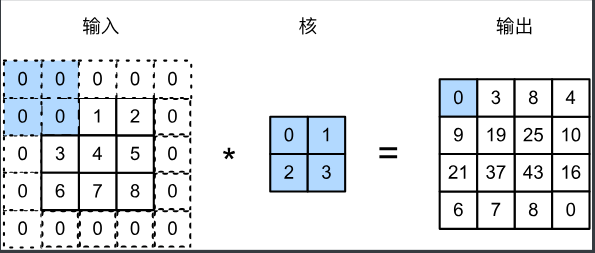

一般来说，如果在高的两侧一共填充$p_h$行，在宽的两侧一共填充$p_w$列，那么输出形状将会是

$$(n_h-k_h+p_h+1)\times(n_w-k_w+p_w+1),$$

也就是说，输出的高和宽会分别增加$p_h$和$p_w$。

**在很多情况下，我们会设置$p_h=k_h-1$和$p_w=k_w-1$来使输入和输出具有相同的高和宽**。这样会方便在构造网络时推测每个层的输出形状。假设这里$k_h$是奇数，我们会在高的两侧分别填充$p_h/2$行。如果$k_h$是偶数，一种可能是在输入的顶端一侧填充$\lceil p_h/2\rceil$行，而在底端一侧填充$\lfloor p_h/2\rfloor$行。在宽的两侧填充同理。

**步幅(stride)**

一般来说，当高上步幅为$s_h$，宽上步幅为$s_w$时，输出形状为

$$\lfloor(n_h-k_h+p_h+s_h)/s_h\rfloor \times \lfloor(n_w-k_w+p_w+s_w)/s_w\rfloor.$$

如果设置$p_h=k_h-1$和$p_w=k_w-1$，那么输出形状将简化为$\lfloor(n_h+s_h-1)/s_h\rfloor \times \lfloor(n_w+s_w-1)/s_w\rfloor$。更进一步，如果输入的高和宽能分别被高和宽上的步幅整除，那么输出形状将是$(n_h/s_h) \times (n_w/s_w)$。

- **填充可以增加输出的高和宽。这常用来使输出与输入具有相同的高和宽。**
- **步幅可以减小输出的高和宽，例如输出的高和宽仅为输入的高和宽的$1/n$（$n$为大于1的整数）。**

#### 3.4.4 多通道(channels)

**多通道输入**

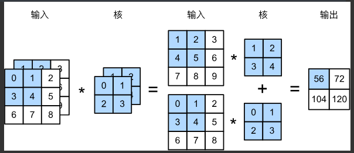

接下来我们实现含多个输入通道的互相关运算。我们只需要对每个通道做互相关运算，每个元素做累加。

**多通道输出** 

**当输入通道有多个时，因为我们对各个通道的结果做了累加，所以不论输入通道数是多少，输出通道数总是为1。**所以我们就在卷积核上提前动手脚预留出来

设卷积核输入通道数和输出通道数分别为$c_i$和$c_o$，高和宽分别为$k_h$和$k_w$。如果希望得到含多个通道的输出，我们可以为每个输出通道分别创建形状为$c_i\times k_h\times k_w$的核数组。将它们在输出通道维上连结，卷积核的形状即$c_o\times c_i\times k_h\times k_w$。在做互相关运算时，每个输出通道上的结果由卷积核在该输出通道上的核数组与整个输入数组计算而来。

**$1\times 1$卷积层**

假设我们将通道维当作特征维，将高和宽维度上的元素当成数据样本，**那么$1\times 1$卷积层的作用与全连接层等价**。

<div align=center>
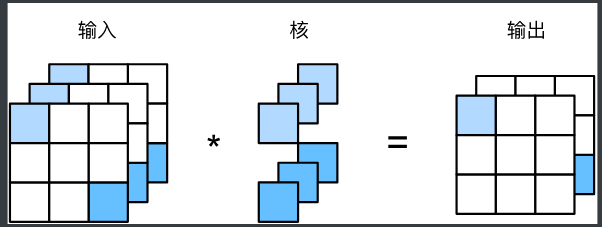
</div>
<div align=center>图5.5 1x1卷积核的互相关计算。输入和输出具有相同的高和宽</div>

在之后的模型里我们将会看到$1\times 1$卷积层被当作保持高和宽维度形状不变的全连接层使用。于是，我们可以通过调整网络层之间的通道数来控制模型复杂度。

- 使用多通道可以拓展卷积层的模型参数。
- 假设将通道维当作特征维，将高和宽维度上的元素当成数据样本，那么$1\times 1$卷积层的作用与全连接层等价。
- $1\times 1$卷积层通常用来调整网络层之间的通道数，并控制模型复杂度。

#### 3.4.5 池化层(pooling)

实际图像里，我们感兴趣的物体不会总出现在固定位置：即使我们连续拍摄同一个物体也极有可能出现像素位置上的偏移。这会导致同一个边缘对应的输出可能出现在卷积输出`Y`中的不同位置，进而对后面的模式识别造成不便。

在本节中我们介绍池化（pooling）层，它的提出是**为了缓解卷积层对位置的过度敏感性**。

> 现在我们将卷积层的输出作为$2\times 2$最大池化的输入。设该卷积层输入是`X`、池化层输出为`Y`。无论是`X[i, j]`和`X[i, j+1]`值不同，还是`X[i, j+1]`和`X[i, j+2]`不同，池化层输出均有`Y[i, j]=1`。也就是说，使用$2\times 2$最大池化层时，只要卷积层识别的模式在高和宽上移动不超过一个元素，我们依然可以将它检测出来。

**池化层填充与步幅**

同卷积层一样，池化层也可以在输入的高和宽两侧的填充并调整窗口的移动步幅来改变输出形状。池化层填充和步幅与卷积层填充和步幅的工作机制一样。

**多通道**

在处理多通道输入数据时，**池化层对每个输入通道分别池化，而不是像卷积层那样将各通道的输入按通道相加**。这意味着池化层的输出通道数与输入通道数相等。

- 最大池化和平均池化分别取池化窗口中输入元素的最大值和平均值作为输出。
- 池化层的一个主要作用是缓解卷积层对位置的过度敏感性。
- 可以指定池化层的填充和步幅。
- 池化层的输出通道数跟输入通道数相同。

## 5. 各种CNN网络

#### 开始之前

多层感知机全连接层

1. 图像在同一列邻近的像素在这个向量中可能相距较远。它们构成的模式可能难以被模型识别。

2. 对于大尺寸的输入图像，使用全连接层容易造成模型过大。假设输入是高和宽均为1000像素的彩色照片（含3个通道）。即使全连接层输出个数仍是256，该层权重参数的形状是$3,000,000\times 256$：它占用了大约3 GB的内存或显存。这带来过复杂的模型和过高的存储开销。

   卷积层尝试解决这两个问题

>1.卷积层保留输入形状，使图像的像素在高和宽两个方向上的相关性均可能被有效识别；
>
>2.卷积层通过滑动窗口将同一卷积核与不同位置的输入重复计算，从而避免参数尺寸过大。

#### 5.1 LeNet

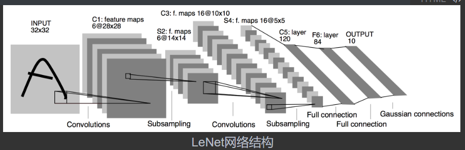

LeNet分为卷积层块和全连接层块两个部分

卷积层用来识别图像里的空间模式，如线条和物体局部，之后的最大池化层则用来降低卷积层对位置的敏感性。

#### 5.2 AlexNet

计算机视觉流程中真正重要的是数据和特征。也就是说，使用较干净的数据集和较有效的特征甚至比机器学习模型的选择对图像分类结果的影响更大。

**学习特征表示**

为了表征足够复杂的输入，特征本身应该分级表示。多层神经网络可能可以学得数据的多级表征，并逐级表示越来越抽象的概念或模式。

在多层神经网络中，图像的第一级的表示可以是在特定的位置和⻆度是否出现边缘；而第二级的表示说不定能够将这些边缘组合出有趣的模式，如花纹；在第三级的表示中，也许上一级的花纹能进一步汇合成对应物体特定部位的模式。这样逐级表示下去，最终，模型能够较容易根据最后一级的表示完成分类任务。需要强调的是，输入的逐级表示由多层模型中的参数决定，而这些参数都是学出来的。

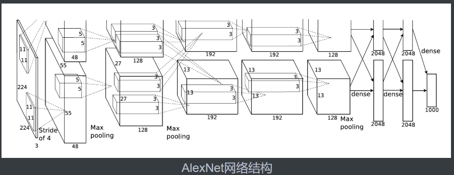

相较于LeNet
1.网络结构变化 2.ReLU代替sigmoid 3.dropout 4.data augmentation

#### 5.3 VGGNet

VGG块的组成规律是：**连续使用数个相同的填充为1、窗口形状为$3\times 3$的卷积层后接上一个步幅为2、窗口形状为$2\times 2$的最大池化层。卷积层保持输入的高和宽不变，而池化层则对其减半。**我们使用`vgg_block`函数来实现这个基础的VGG块，它可以指定卷积层的数量和输入输出通道数。

> 对于给定的感受野（与输出有关的输入图片的局部大小），采用堆积的小卷积核优于采用大的卷积核，因为可以增加网络深度来保证学习更复杂的模式，而且代价还比较小（参数更少）。例如，在VGG中，使用了3个3x3卷积核来代替7x7卷积核，使用了2个3x3卷积核来代替5*5卷积核，这样做的主要目的是在保证具有相同感知野的条件下，提升了网络的深度，在一定程度上提升了神经网络的效果。

AlexNet和VGG对LeNet的改进主要在于如何对这两个模块加宽（增加通道数）和加深。

#### 5.4 NiN模型

先以由卷积层构成的模块充分抽取空间特征，再以由全连接层构成的模块来输出分类结果。

网络中的网络（NiN）: 它提出了另外一个思路，即串联多个由卷积层和“全连接”层构成的小网络来构建一个深层网络。

我们知道，卷积层的输入和输出通常是四维数组（样本，通道，高，宽），而全连接层的输入和输出则通常是二维数组（样本，特征）。如果想在全连接层后再接上卷积层，则需要将全连接层的输出变换为四维。回忆在5.3节（多输入通道和多输出通道）里介绍的$1\times 1$卷积层。它可以看成全连接层，其中空间维度（高和宽）上的每个元素相当于样本，通道相当于特征。因此，NiN使用$1\times 1$卷积层来替代全连接层，从而使空间信息能够自然传递到后面的层中去。图5.7对比了NiN同AlexNet和VGG等网络在结构上的主要区别。

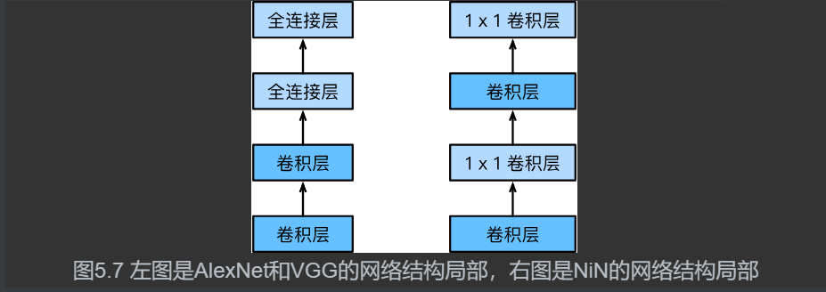

#### 5.4 GoogLeNet 并行连结网络（Inception块）

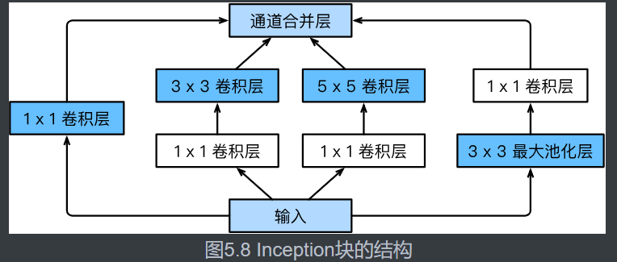

由图5.8可以看出，Inception块里有4条并行的线路。前3条线路使用窗口大小分别是$1\times 1$、$3\times 3$和$5\times 5$的卷积层来抽取不同空间尺寸下的信息，其中中间2个线路会对输入先做$1\times 1$卷积来减少输入通道数，以降低模型复杂度。第四条线路则使用$3\times 3$最大池化层，后接$1\times 1$卷积层来改变通道数。4条线路都使用了合适的填充来使输入与输出的高和宽一致。最后我们将每条线路的输出在通道维上连结，并输入接下来的层中去。

- Inception块相当于一个有4条线路的子网络。它通过不同窗口形状的卷积层和最大池化层来并行抽取信息，并使用$1\times 1$卷积层减少通道数从而降低模型复杂度。
- GoogLeNet将多个设计精细的Inception块和其他层串联起来。其中Inception块的通道数分配之比是在ImageNet数据集上通过大量的实验得来的。
- GoogLeNet和它的后继者们一度是ImageNet上最高效的模型之一：在类似的测试精度下，它们的计算复杂度往往更低。

#### 5.5  Batch Normalization 层

### 5.5.1对全连接层做批量归一化

我们先考虑如何对全连接层做批量归一化。通常，我们将批量归一化层置于全连接层中的仿射变换和激活函数之间。设全连接层的输入为$\boldsymbol{u}$，权重参数和偏差参数分别为$\boldsymbol{W}$和$\boldsymbol{b}$，激活函数为$\phi$。设批量归一化的运算符为$\text{BN}$。那么，使用批量归一化的全连接层的输出为

$$\phi(\text{BN}(\boldsymbol{x})),$$

其中批量归一化输入$\boldsymbol{x}$由仿射变换

$$\boldsymbol{x} = \boldsymbol{W\boldsymbol{u} + \boldsymbol{b}}$$

得到。考虑一个由$m$个样本组成的小批量，仿射变换的输出为一个新的小批量$\mathcal{B} = \{\boldsymbol{x}^{(1)}, \ldots, \boldsymbol{x}^{(m)} \}$。它们正是批量归一化层的输入。对于小批量$\mathcal{B}$中任意样本$\boldsymbol{x}^{(i)} \in \mathbb{R}^d, 1 \leq  i \leq m$，批量归一化层的输出同样是$d$维向量

$$\boldsymbol{y}^{(i)} = \text{BN}(\boldsymbol{x}^{(i)}),$$

并由以下几步求得。首先，对小批量$\mathcal{B}$求均值和方差：

$$\boldsymbol{\mu}_\mathcal{B} \leftarrow \frac{1}{m}\sum_{i = 1}^{m} \boldsymbol{x}^{(i)},$$
$$\boldsymbol{\sigma}_\mathcal{B}^2 \leftarrow \frac{1}{m} \sum_{i=1}^{m}(\boldsymbol{x}^{(i)} - \boldsymbol{\mu}_\mathcal{B})^2,$$

其中的平方计算是按元素求平方。接下来，使用按元素开方和按元素除法对$\boldsymbol{x}^{(i)}$标准化：

$$\hat{\boldsymbol{x}}^{(i)} \leftarrow \frac{\boldsymbol{x}^{(i)} - \boldsymbol{\mu}_\mathcal{B}}{\sqrt{\boldsymbol{\sigma}_\mathcal{B}^2 + \epsilon}},$$

这里$\epsilon > 0$是一个很小的常数，保证分母大于0。在上面标准化的基础上，批量归一化层引入了两个可以学习的模型参数，拉伸（scale）参数 $\boldsymbol{\gamma}$ 和偏移（shift）参数 $\boldsymbol{\beta}$。这两个参数和$\boldsymbol{x}^{(i)}$形状相同，皆为$d$维向量。它们与$\boldsymbol{x}^{(i)}$分别做按元素乘法（符号$\odot$）和加法计算：

$${\boldsymbol{y}}^{(i)} \leftarrow \boldsymbol{\gamma} \odot \hat{\boldsymbol{x}}^{(i)} + \boldsymbol{\beta}.$$

至此，我们得到了$\boldsymbol{x}^{(i)}$的批量归一化的输出$\boldsymbol{y}^{(i)}$。
值得注意的是，可学习的拉伸和偏移参数保留了不对$\hat{\boldsymbol{x}}^{(i)}$做批量归一化的可能：此时只需学出$\boldsymbol{\gamma} = \sqrt{\boldsymbol{\sigma}_\mathcal{B}^2 + \epsilon}$和$\boldsymbol{\beta} = \boldsymbol{\mu}_\mathcal{B}$。我们可以对此这样理解：如果批量归一化无益，理论上，学出的模型可以不使用批量归一化。

### 5.5.2 对卷积层做批量归一化

对卷积层来说，批量归一化发生在卷积计算之后、应用激活函数之前。如果卷积计算输出多个通道，我们需要对这些通道的输出分别做批量归一化，且**每个通道都拥有独立的拉伸和偏移参数，并均为标量**。设小批量中有$m$个样本。在单个通道上，假设卷积计算输出的高和宽分别为$p$和$q$。我们需要对该通道中$m \times p \times q$个元素同时做批量归一化。对这些元素做标准化计算时，我们使用相同的均值和方差，即该通道中$m \times p \times q$个元素的均值和方差。

### 5.5.3 预测时的批量归一化

使用批量归一化训练时，我们可以将批量大小设得大一点，从而使批量内样本的均值和方差的计算都较为准确。将训练好的模型用于预测时，我们希望模型对于任意输入都有确定的输出。因此，单个样本的输出不应取决于批量归一化所需要的随机小批量中的均值和方差。一种常用的方法是通过移动平均估算整个训练数据集的样本均值和方差，并在预测时使用它们得到确定的输出。可见，和丢弃层一样，批量归一化层在训练模式和预测模式下的计算结果也是不一样的。

- 在模型训练时，批量归一化利用小批量上的均值和标准差，不断调整神经网络的中间输出，从而使整个神经网络在各层的中间输出的数值更稳定。
- 对全连接层和卷积层做批量归一化的方法稍有不同。
- 批量归一化层和丢弃层一样，在训练模式和预测模式的计算结果是不一样的。
- PyTorch提供了BatchNorm类方便使用。

#### 5.6 ResNet 

让我们聚焦于神经网络局部。如图5.9所示，设输入为$\boldsymbol{x}$。假设我们希望学出的理想映射为$f(\boldsymbol{x})$，从而作为图5.9上方激活函数的输入。左图虚线框中的部分需要直接拟合出该映射$f(\boldsymbol{x})$，而右图虚线框中的部分则需要拟合出有关恒等映射的残差映射$f(\boldsymbol{x})-\boldsymbol{x}$。残差映射在实际中往往更容易优化。以本节开头提到的恒等映射作为我们希望学出的理想映射$f(\boldsymbol{x})$。我们只需将图5.9中右图虚线框内上方的加权运算（如仿射）的权重和偏差参数学成0，那么$f(\boldsymbol{x})$即为恒等映射。实际中，当理想映射$f(\boldsymbol{x})$极接近于恒等映射时，残差映射也易于捕捉恒等映射的细微波动。图5.9右图也是ResNet的基础块，即残差块（residual block）。在残差块中，输入可通过跨层的数据线路更快地向前传播。

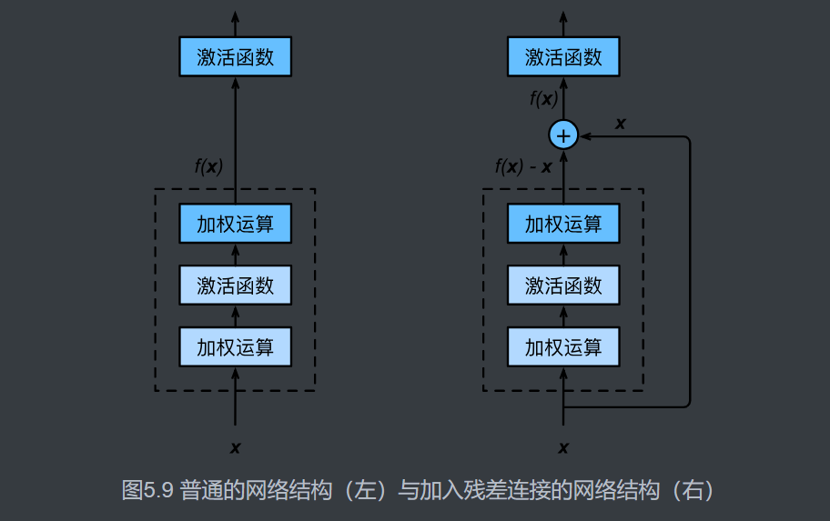

- 残差块通过跨层的数据通道从而能够训练出有效的深度神经网络。
- ResNet深刻影响了后来的深度神经网络的设计。

#### DenseNet

ResNet中的跨层连接设计引申出了数个后续工作。本节我们介绍其中的一个：稠密连接网络（DenseNet） [1]。 它与ResNet的主要区别如图5.10所示。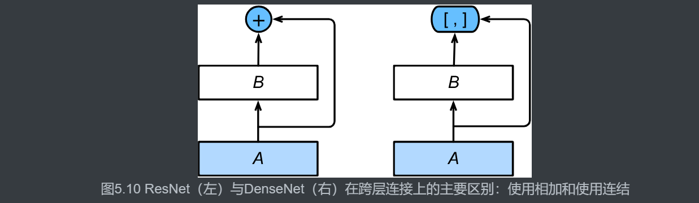

图5.10中将部分前后相邻的运算抽象为模块$A$和模块$B$。与ResNet的主要区别在于，DenseNet里模块$B$的输出不是像ResNet那样和模块$A$的输出相加，而是在通道维上连结。这样模块$A$的输出可以直接传入模块$B$后面的层。在这个设计里，模块$A$直接跟模块$B$后面的所有层连接在了一起。这也是它被称为“稠密连接”的原因。

DenseNet的主要构建模块是稠密块（dense block）和过渡层（transition layer）。前者定义了输入和输出是如何连结的，后者则用来控制通道数，使之不过大。

- 在跨层连接上，不同于ResNet中将输入与输出相加，DenseNet在通道维上连结输入与输出。
- DenseNet的主要构建模块是稠密块和过渡层。

## 6.优化

#### 6.1 intro

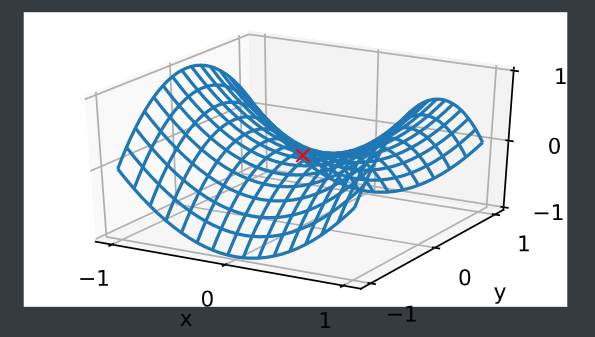

在图的鞍点位置，目标函数在$x$轴方向上是局部最小值，但在$y$轴方向上是局部最大值。

假设一个函数的输入为$k$维向量，输出为标量，那么它的海森矩阵（Hessian matrix）有$k$个特征值。该函数在梯度为0的位置上可能是局部最小值、局部最大值或者鞍点。

- 当函数的海森矩阵在梯度为零的位置上的特征值全为正时，该函数得到局部最小值。
- 当函数的海森矩阵在梯度为零的位置上的特征值全为负时，该函数得到局部最大值。
- 当函数的海森矩阵在梯度为零的位置上的特征值有正有负时，该函数得到鞍点。

在深度学习中，虽然找到目标函数的全局最优解很难，但这并非必要。我们将在本章接下来的几节中逐一介绍深度学习中常用的优化算法，它们在很多实际问题中都能够训练出十分有效的深度学习模型。

- 由于优化算法的目标函数通常是一个基于训练数据集的损失函数，优化的目标在于降低训练误差。
- 由于深度学习模型参数通常都是高维的，目标函数的鞍点通常比局部最小值更常见.

#### 6.2 gd-sgd

比较简单，原文写的很好

如果使用过大的学习率，$\left|\eta f'(x)\right|$可能会过大从而使前面提到的一阶泰勒展开公式不再成立：这时我们无法保证迭代$x$会降低$f(x)$的值。

**2D优化的绘图**

```python
def train_2d(trainer):  # 本函数将保存在d2lzh_pytorch包中方便以后使用
    x1, x2, s1, s2 = -5, -2, 0, 0  # s1和s2是自变量状态，本章后续几节会使用
    results = [(x1, x2)]
    for i in range(20):
        x1, x2, s1, s2 = trainer(x1, x2, s1, s2)
        results.append((x1, x2))
    print('epoch %d, x1 %f, x2 %f' % (i + 1, x1, x2))
    return results

def show_trace_2d(f, results):  # 本函数将保存在d2lzh_pytorch包中方便以后使用
    d2l.plt.plot(*zip(*results), '-o', color='#ff7f0e')
    x1, x2 = np.meshgrid(np.arange(-5.5, 1.0, 0.1), np.arange(-3.0, 1.0, 0.1))
    d2l.plt.contour(x1, x2, f(x1, x2), colors='#1f77b4')
    d2l.plt.xlabel('x1')
    d2l.plt.ylabel('x2')
```

#### 6.3 随机梯度下降

随机梯度下降（stochastic gradient descent，SGD）减少了每次迭代的计算开销。在随机梯度下降的每次迭代中，我们随机均匀采样的一个样本索引$i\in\{1,\ldots,n\}$，并计算梯度$\nabla f_i(\boldsymbol{x})$来迭代$\boldsymbol{x}$：

$$\boldsymbol{x} \leftarrow \boldsymbol{x} - \eta \nabla f_i(\boldsymbol{x}).$$

这里$\eta$同样是学习率。可以看到每次迭代的计算开销从梯度下降的$\mathcal{O}(n)$降到了常数$\mathcal{O}(1)$。值得强调的是，随机梯度$\nabla f_i(\boldsymbol{x})$是对梯度$\nabla f(\boldsymbol{x})$的无偏估计：

$$E_i \nabla f_i(\boldsymbol{x}) = \frac{1}{n} \sum_{i = 1}^n \nabla f_i(\boldsymbol{x}) = \nabla f(\boldsymbol{x}).$$

- 使用适当的学习率，沿着梯度反方向更新自变量可能降低目标函数值。梯度下降重复这一更新过程直到得到满足要求的解。
- 学习率过大或过小都有问题。一个合适的学习率通常是需要通过多次实验找到的。
- 当训练数据集的样本较多时，梯度下降每次迭代的计算开销较大，因而随机梯度下降通常更受青睐。

#### 6.4 minibatch SGD

我们可以通过重复采样（sampling with replacement）或者不重复采样（sampling without replacement）得到一个小批量中的各个样本。前者允许同一个小批量中出现重复的样本，后者则不允许如此，且更常见。对于这两者间的任一种方式，都可以使用
$$
\boldsymbol{g}_t \leftarrow \nabla f_{\mathcal{B}_t}(\boldsymbol{x}_{t-1}) = \frac{1}{|\mathcal{B}|} \sum_{i \in \mathcal{B}_t}\nabla f_i(\boldsymbol{x}_{t-1})
$$

> 求了一个和

来计算时间步$t$的小批量$\mathcal{B}_t$上目标函数位于$\boldsymbol{x}_{t-1}$处的梯度$\boldsymbol{g}_t$。这里$|\mathcal{B}|$代表批量大小，即小批量中样本的个数，是一个超参数。同随机梯度一样，重复采样所得的小批量随机梯度$\boldsymbol{g}_t$也是对梯度$\nabla f(\boldsymbol{x}_{t-1})$的无偏估计。给定学习率$\eta_t$（取正数），小批量随机梯度下降对自变量的迭代如下：

$$\boldsymbol{x}_t \leftarrow \boldsymbol{x}_{t-1} - \eta_t \boldsymbol{g}_t.$$

基于随机采样得到的梯度的方差在迭代过程中无法减小，因此在实际中，（小批量）随机梯度下降的学习率可以在迭代过程中自我衰减，例如$\eta_t=\eta t^\alpha$（通常$\alpha=-1$或者$-0.5$）、$\eta_t = \eta \alpha^t$（如$\alpha=0.95$）或者每迭代若干次后将学习率衰减一次。如此一来，学习率和（小批量）随机梯度乘积的方差会减小。而梯度下降在迭代过程中一直使用目标函数的真实梯度，无须自我衰减学习率。

小批量随机梯度下降中每次迭代的计算开销为$\mathcal{O}(|\mathcal{B}|)$。当批量大小为1时，该算法即为随机梯度下降；当批量大小等于训练数据样本数时，该算法即为梯度下降。当批量较小时，每次迭代中使用的样本少，这会导致并行处理和内存使用效率变低。这使得在计算同样数目样本的情况下比使用更大批量时所花时间更多。当批量较大时，每个小批量梯度里可能含有更多的冗余信息。为了得到较好的解，批量较大时比批量较小时需要计算的样本数目可能更多，例如增大迭代周期数。

- 小批量随机梯度每次随机均匀采样一个小批量的训练样本来计算梯度。
- 在实际中，（小批量）随机梯度下降的学习率可以在迭代过程中自我衰减。
- 通常，小批量随机梯度在每个迭代周期的耗时介于梯度下降和随机梯度下降的耗时之间。

#### 6.5 momentum

梯度下降问题：最陡下降（steepest descent）

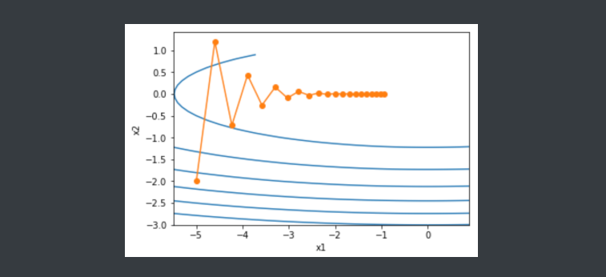

给定学习率，梯度下降迭代自变量时会使自变量在竖直方向比在水平方向移动幅度更大。那么，我们需要一个较小的学习率从而避免自变量在竖直方向上越过目标函数最优解。然而，这会造成自变量在水平方向上朝最优解移动变慢。


这就导致了水平不敏感，竖直敏感的情况

动量法：解决梯度下降的上述问题

设时间步$t$的自变量为$\boldsymbol{x}_t$，学习率为$\eta_t$。
在时间步$0$，动量法创建速度变量$\boldsymbol{v}_0$，并将其元素初始化成0。在时间步$t>0$，动量法对每次迭代的步骤做如下修改：
$$
\begin{aligned}\boldsymbol{v}_t &\leftarrow \gamma \boldsymbol{v}_{t-1} + \eta_t \boldsymbol{g}_t, \\\boldsymbol{x}_t &\leftarrow \boldsymbol{x}_{t-1} - \boldsymbol{v}_t,\end{aligned}
$$
其中，动量超参数$\gamma$满足$0 \leq \gamma < 1$。当$\gamma=0$时，动量法等价于小批量随机梯度下降。

在解释动量法的数学原理前，让我们先从实验中观察梯度下降在使用动量法后的迭代轨迹。


可以看到使用较小的学习率$\eta=0.4$和动量超参数$\gamma=0.5$时，动量法在竖直方向上的移动更加平滑，且在水平方向上更快逼近最优解。下面使用较大的学习率$\eta=0.6$，此时自变量也不再发散。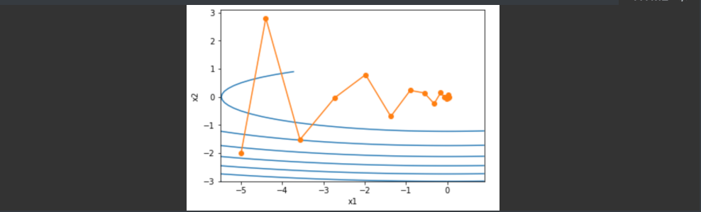

**由指数加权移动平均理解动量法**

现在，我们对动量法的速度变量做变形：

$$\boldsymbol{v}_t \leftarrow \gamma \boldsymbol{v}_{t-1} + (1 - \gamma) \left(\frac{\eta_t}{1 - \gamma} \boldsymbol{g}_t\right). $$

由指数加权移动平均的形式可得，速度变量$\boldsymbol{v}_t$实际上对序列$\{\eta_{t-i}\boldsymbol{g}_{t-i} /(1-\gamma):i=0,\ldots,1/(1-\gamma)-1\}$做了指数加权移动平均。换句话说，相比于小批量随机梯度下降，**动量法在每个时间步的自变量更新量近似于将最近$1/(1-\gamma)$个时间步的普通更新量（即学习率乘以梯度）做了指数加权移动平均后再除以$1-\gamma$**。所以，在动量法中，自变量在各个方向上的移动幅度不仅取决当前梯度，还取决于过去的各个梯度在各个方向上是否一致。在本节之前示例的优化问题中，所有梯度在水平方向上为正（向右），而在竖直方向上时正（向上）时负（向下）。这样，我们就可以使用较大的学习率，从而使自变量向最优解更快移动。

关于momentum参数的理解： 如果momentum = 0.5 ，2个时间步；momentum = 0.9， 10个时间步； momentum = 0.95， 20个时间步

- 动量法使用了指数加权移动平均的思想。它将过去时间步的梯度做了加权平均，且权重按时间步指数衰减。
- 动量法使得相邻时间步的自变量更新在方向上更加一致。

#### 6.6 AdaGrad 

在（动量法）里我们看到当$x_1$和$x_2$的梯度值有较大差别时，需要选择足够小的学习率使得自变量在梯度值较大的维度上不发散。但这样会导致自变量在梯度值较小的维度上迭代过慢。动量法依赖指数加权移动平均使得自变量的更新方向更加一致，从而降低发散的可能。

AdaGrad算法会使用一个小批量随机梯度$\boldsymbol{g}_t$按元素平方的累加变量$\boldsymbol{s}_t$。在时间步0，AdaGrad将$\boldsymbol{s}_0$中每个元素初始化为0。在时间步$t$，首先将小批量随机梯度$\boldsymbol{g}_t$按元素平方后累加到变量$\boldsymbol{s}_t$：

$$\boldsymbol{s}_t \leftarrow \boldsymbol{s}_{t-1} + \boldsymbol{g}_t \odot \boldsymbol{g}_t,$$

其中$\odot$是按元素相乘。接着，我们将目标函数自变量中每个元素的学习率通过按元素运算重新调整一下：

$$\boldsymbol{x}_t \leftarrow \boldsymbol{x}_{t-1} - \frac{\eta}{\sqrt{\boldsymbol{s}_t + \epsilon}} \odot \boldsymbol{g}_t,$$

其中$\eta$是学习率，$\epsilon$是为了维持数值稳定性而添加的常数，如$10^{-6}$。这里开方、除法和乘法的运算都是按元素运算的。这些按元素运算使得目标函数自变量中每个元素都分别拥有自己的学习率。

**特点**

需要强调的是，小批量随机梯度按元素平方的累加变量$\boldsymbol{s}_t$出现在学习率的分母项中。因此，如果目标函数有关自变量中某个元素的偏导数一直都较大，那么该元素的学习率将下降较快；反之，如果目标函数有关自变量中某个元素的偏导数一直都较小，那么该元素的学习率将下降较慢。然而，由于$\boldsymbol{s}_t$一直在累加按元素平方的梯度，自变量中每个元素的学习率在迭代过程中一直在降低（或不变）。所以，**当学习率在迭代早期降得较快且当前解依然不佳时，AdaGrad算法在迭代后期由于学习率过小，可能较难找到一个有用的解**。

- AdaGrad算法在迭代过程中不断调整学习率，并让目标函数自变量中每个元素都分别拥有自己的学习率。
- 使用AdaGrad算法时，自变量中每个元素的学习率在迭代过程中一直在降低（或不变）。

#### 6.7 RMSProp

解决上述问题，RMSProp算法对AdaGrad算法做了一点小小的修改

RMSProp算法将这些梯度按元素平方做指数加权移动平均。具体来说，给定超参数$0 \leq \gamma < 1$，RMSProp算法在时间步$t>0$计算

$$\boldsymbol{s}_t \leftarrow \gamma \boldsymbol{s}_{t-1} + (1 - \gamma) \boldsymbol{g}_t \odot \boldsymbol{g}_t. $$

和AdaGrad算法一样，RMSProp算法将目标函数自变量中每个元素的学习率通过按元素运算重新调整，然后更新自变量

$$\boldsymbol{x}_t \leftarrow \boldsymbol{x}_{t-1} - \frac{\eta}{\sqrt{\boldsymbol{s}_t + \epsilon}} \odot \boldsymbol{g}_t, $$

其中$\eta$是学习率，$\epsilon$是为了维持数值稳定性而添加的常数，如$10^{-6}$。因为RMSProp算法的状态变量$\boldsymbol{s}_t$是对平方项$\boldsymbol{g}_t \odot \boldsymbol{g}_t$的指数加权移动平均，所以可以看作是最近$1/(1-\gamma)$个时间步的小批量随机梯度平方项的加权平均。如此一来，自变量每个元素的学习率在迭代过程中就不再一直降低（或不变）。

RMSProp算法和AdaGrad算法的不同在于，RMSProp算法使用了小批量随机梯度按元素平方的指数加权移动平均来调整学习率。

#### 6.8 AdaDelta 

$$\boldsymbol{s}_t \leftarrow \rho \boldsymbol{s}_{t-1} + (1 - \rho) \boldsymbol{g}_t \odot \boldsymbol{g}_t. $$

与RMSProp算法不同的是，AdaDelta算法还维护一个额外的状态变量$\Delta\boldsymbol{x}_t$，其元素同样在时间步0时被初始化为0。我们使用$\Delta\boldsymbol{x}_{t-1}$来计算自变量的变化量：

$$ \boldsymbol{g}_t' \leftarrow \sqrt{\frac{\Delta\boldsymbol{x}_{t-1} + \epsilon}{\boldsymbol{s}_t + \epsilon}}   \odot \boldsymbol{g}_t, $$

其中$\epsilon$是为了维持数值稳定性而添加的常数，如$10^{-5}$。接着更新自变量：

$$\boldsymbol{x}_t \leftarrow \boldsymbol{x}_{t-1} - \boldsymbol{g}'_t. $$

最后，我们使用$\Delta\boldsymbol{x}_t$来记录自变量变化量$\boldsymbol{g}'_t$按元素平方的指数加权移动平均：

$$\Delta\boldsymbol{x}_t \leftarrow \rho \Delta\boldsymbol{x}_{t-1} + (1 - \rho) \boldsymbol{g}'_t \odot \boldsymbol{g}'_t. $$

可以看到，如不考虑$\epsilon$的影响，**AdaDelta算法跟RMSProp算法的不同之处在于使用$\sqrt{\Delta\boldsymbol{x}_{t-1}}$来替代学习率$\eta$**。

#### 6.9 Adam 算法

Adam算法可以看做是RMSProp算法与动量法的结合。

Adam算法使用了动量变量$\boldsymbol{v}_t$和RMSProp算法中小批量随机梯度按元素平方的指数加权移动平均变量$\boldsymbol{s}_t$，并在时间步0将它们中每个元素初始化为0。给定超参数$0 \leq \beta_1 < 1$（算法作者建议设为0.9），时间步$t$的动量变量$\boldsymbol{v}_t$即小批量随机梯度$\boldsymbol{g}_t$的指数加权移动平均：

$$\boldsymbol{v}_t \leftarrow \beta_1 \boldsymbol{v}_{t-1} + (1 - \beta_1) \boldsymbol{g}_t. $$

和RMSProp算法中一样，给定超参数$0 \leq \beta_2 < 1$（算法作者建议设为0.999），
将小批量随机梯度按元素平方后的项$\boldsymbol{g}_t \odot \boldsymbol{g}_t$做指数加权移动平均得到$\boldsymbol{s}_t$：

$$\boldsymbol{s}_t \leftarrow \beta_2 \boldsymbol{s}_{t-1} + (1 - \beta_2) \boldsymbol{g}_t \odot \boldsymbol{g}_t. $$

由于我们将$\boldsymbol{v}_0$和$\boldsymbol{s}_0$中的元素都初始化为0，
在时间步$t$我们得到$\boldsymbol{v}_t =  (1-\beta_1) \sum_{i=1}^t \beta_1^{t-i} \boldsymbol{g}_i$。将过去各时间步小批量随机梯度的权值相加，得到 $(1-\beta_1) \sum_{i=1}^t \beta_1^{t-i} = 1 - \beta_1^t$。需要注意的是，当$t$较小时，过去各时间步小批量随机梯度权值之和会较小。例如，当$\beta_1 = 0.9$时，$\boldsymbol{v}_1 = 0.1\boldsymbol{g}_1$。为了消除这样的影响，对于任意时间步$t$，我们可以将$\boldsymbol{v}_t$再除以$1 - \beta_1^t$，从而使过去各时间步小批量随机梯度权值之和为1。这也叫作偏差修正。在Adam算法中，我们对变量$\boldsymbol{v}_t$和$\boldsymbol{s}_t$均作偏差修正：

$$\hat{\boldsymbol{v}}_t \leftarrow \frac{\boldsymbol{v}_t}{1 - \beta_1^t}, $$

$$\hat{\boldsymbol{s}}_t \leftarrow \frac{\boldsymbol{s}_t}{1 - \beta_2^t}. $$

接下来，Adam算法使用以上偏差修正后的变量$\hat{\boldsymbol{v}}_t$和$\hat{\boldsymbol{s}}_t$，将模型参数中每个元素的学习率通过按元素运算重新调整：

$$\boldsymbol{g}_t' \leftarrow \frac{\eta \hat{\boldsymbol{v}}_t}{\sqrt{\hat{\boldsymbol{s}}_t} + \epsilon},$$

其中$\eta$是学习率，$\epsilon$是为了维持数值稳定性而添加的常数，如$10^{-8}$。和AdaGrad算法、RMSProp算法以及AdaDelta算法一样，目标函数自变量中每个元素都分别拥有自己的学习率。最后，使用$\boldsymbol{g}_t'$迭代自变量：

$$\boldsymbol{x}_t \leftarrow \boldsymbol{x}_{t-1} - \boldsymbol{g}_t'. $$

- Adam算法在RMSProp算法的基础上对小批量随机梯度也做了指数加权移动平均。
- Adam算法使用了偏差修正。

### 9. Computer Vision

#### 9.1 Image-augmentation

图像增广（image augmentation）技术通过对训练图像做一系列随机改变，来产生相似但又不同的训练样本，从而扩大训练数据集的规模。图像增广的另一种解释是，随机改变训练样本可以降低模型对某些属性的依赖，从而提高模型的泛化能力。例如，我们可以对图像进行不同方式的裁剪，使感兴趣的物体出现在不同位置，从而减轻模型对物体出现位置的依赖性。我们也可以调整亮度、色彩等因素来降低模型对色彩的敏感度。

#### 9.1.1 翻转、裁剪、颜色变化

**翻转**

```python
torchvision.transforms.RandomHorizontalFlip(img)
```

**裁剪**

```
torchvision.transforms.RandomResizedCrop()
```

**颜色变化**

亮度（`brightness`）、对比度（`contrast`）、饱和度（`saturation`）和色调（`hue`）

```python
 torchvision.transforms.ColorJitter(brightness=0.5,hue=0.5,contrast=0.5,saturation=0.5)
```

**compose** **叠加**

```python
augs = torchvision.transforms.Compose([
    torchvision.transforms.RandomHorizontalFlip(), torchvision.transforms.RandomResizedCrop(200, scale=(0.1, 1), ratio=(0.5, 2)), torchvision.transforms.ColorJitter(brightness=0.5,hue=0.5,contrast=0.5,saturation=0.5)])
# 可以让这些变换等于一个变量
```

```python
# 在实际中一般必用的ToTensor
torchvision.transforms.ToTensor()
# 以及常常要标准化
torchvision.transforms.Normalize(mean=[0.485, 0.456, 0.406], std=[0.229, 0.224, 0.225])
```

#### 9.2 微调(fine tuning)

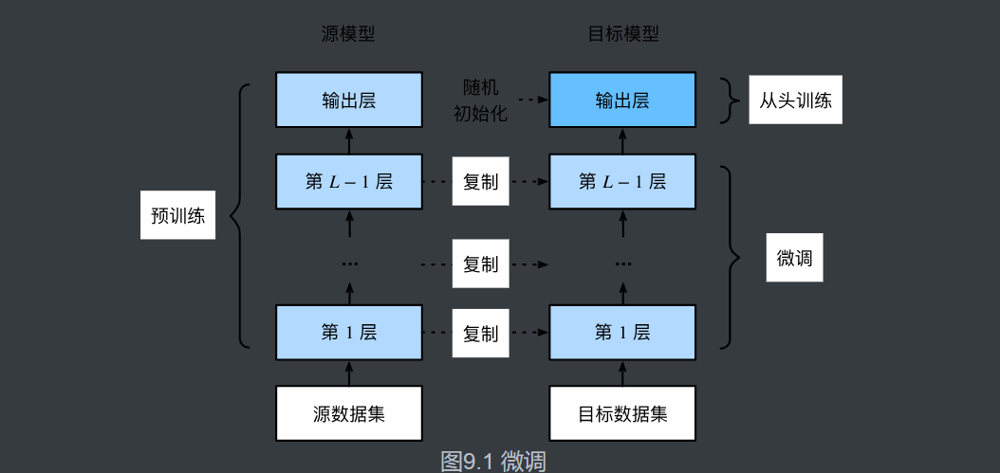

当目标数据集远小于源数据集时，微调有助于提升模型的泛化能力。

```python
pretrained_net = models.resnet18(pretrained=True) # 下载预训练好了的
pretrained_net.fc = nn.Linear(512, 2)  # 把最后一层初始化 
output_params = list(map(id, pretrained_net.fc.parameters()))
feature_params = filter(lambda p: id(p) not in output_params, pretrained_net.parameters())

lr = 0.01
optimizer = optim.SGD([{'params': feature_params},
                       {'params': pretrained_net.fc.parameters(), 'lr': lr * 10}],
                       lr=lr, weight_decay=0.001)
```


- 迁移学习将从源数据集学到的知识迁移到目标数据集上。微调是迁移学习的一种常用技术。
- 目标模型复制了源模型上除了输出层外的所有模型设计及其参数，并基于目标数据集微调这些参数。而目标模型的输出层需要从头训练。
- 一般来说，微调参数会使用较小的学习率，而从头训练输出层可以使用较大的学习率。

#### 9.3 目标检测框

略

#### 9.4 anchor  锚框

略