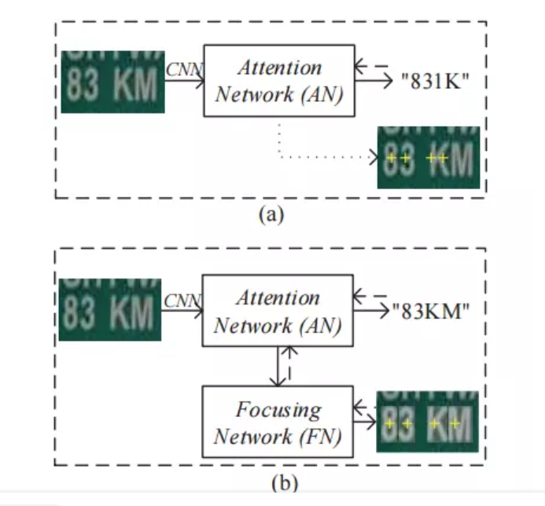

LSTM

http://colah.github.io/posts/2015-08-Understanding-LSTMs/

http://karpathy.github.io/2015/05/21/rnn-effectiveness/

numpy实现 siraj raval LSTM

https://www.youtube.com/watch?v=9zhrxE5PQgY

对3d的肝进行LSTM， 按照Z轴切片， CNN找特征， LSTM理解注意力

注意力论文综述

https://blog.csdn.net/xys430381_1/article/details/89323444

图像分类中的注意力机制

https://blog.csdn.net/Wayne2019/article/details/78488142

### **Residual Attention Network for Image Classification**

注意力不仅仅是focus location ， 而且还是 different representation of objects

---

自然图片的文本识别一直是一个热门的研究领域，目前主流的做法由之前的CNN+RNN+CTC变成了CNN+attention-based encoder-decoder framework

图a所示就是一般的 attention-based 网络结构，图中有一些黄色的十字，这表示在识别每一位字符的时候注意力集中的位置，可以发现前面"8"和"3"的注意力机制还比较好，但到了后面"K"和"M"的时候，注意力已经偏掉了，所以导致最后识别出现错误。而本篇论文提出的Focusing Network能够成功的纠正注意力的偏移，让注意力重新集中到正确的位置，这是本文最大的创新。

[FAN]: https://arxiv.org/pdf/1709.02054.pdf

本篇论文的模型分为两个，第一个是Attention Network，第二个是Focusing Network

---

近几年来，深度学习与视觉注意力机制结合的研究工作，大多数是集中于使用掩码(mask)来形成注意力机制。掩码的原理在于通过另一层新的权重，将图片数据中关键的特征标识出来，通过学习训练，让深度神经网络学到每一张新图片中需要关注的区域，也就形成了注意力。

强注意力： reinforcelearning

软注意力：

