为了理解图像方面的注意力模型，先找一个图像上的注意力的应用

[1]Kulkarni, Girish, et al. "BabyTalk: Understanding and Generating Simple Image Descriptions." IEEE Conference on Computer Vision and Pattern Recognition IEEE Computer Society, 2011:1601-1608. 

[2]Farhadi, Ali, et al. Every Picture Tells a Story: Generating Sentences from Images. Computer Vision – ECCV 2010. Springer Berlin Heidelberg, 2010:15-29.

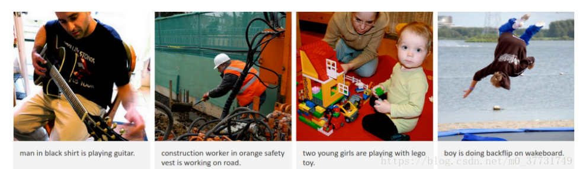

​    图像理解可以认为是一种动态的目标检测，由全局信息生成图像摘要。早先的做法例如《Baby Talk》，《Every picture tell a story》等都是利用图像处理的一些算子提取出图像的特征，经过SVM分类等等得到图像中可能存在的目标object。根据提取出的object以及它们的属性利用CRF或者是一些认为制定的规则来恢复成对图像的描述。这种做法非常依赖于1）图像特征的提取2）生成句子时所需要的规则。自然而然这种效果并不理想。

图像是另外一种文字， g**oogle团队则将机器翻译中编码源文字的RNN替换成CNN来编码图像**，希望用这种方式来获得图像的描述。

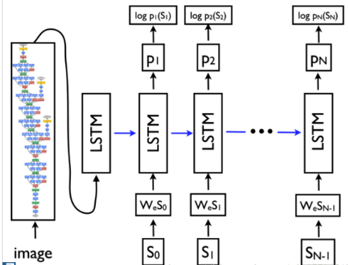

**李飞飞Neural Talk  VGG+RNN**

**encoder-decoder框架对后人做图像理解提供了一条鲜明的道路**

之后有些人工作来了

[5]Jia, Xu, et al. "Guiding Long-Short Term Memory for Image Caption Generation." (2015). 

[6]Wu, Qi, et al. "What Value Do Explicit High Level Concepts Have in Vision to Language Problems?." Computer Vision and Pattern Recognition IEEE, 2016:203-212.

**glstm**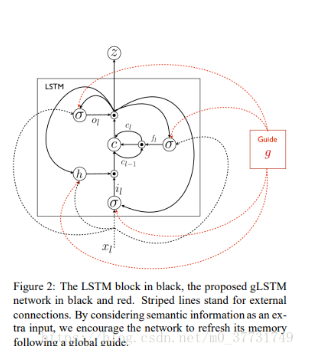 先不管，反正贡献是图像特征参与每个单词的形成

**att-LSTM**

att-LSTM则是非常有意思。别人都用全局图像信息作为图像特征，提取出的4096-d特征都是编码过后的，没有人能说得清每一个维度代表着什么。att-LSTM则是通过图像多标签分类来提取出图像中可能存在的属性。这些属性则是根据字典中出现频率最高的一些单词所组成的。利用手工剔除非法字符，合并不同时态，单复数形态的方式，认为的剔除噪声。剩下的就和之前一样，将att传入LSTM的偏置。

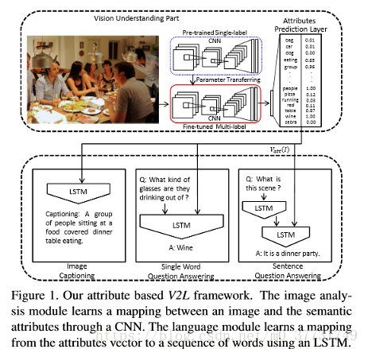

---

下面网络加入了 attention机制

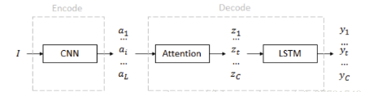

Xu, Kelvin, et al. "Show, Attend and Tell: Neural Image Caption Generation with Visual Attention." Computer Science (2015):2048-2057.

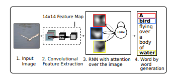

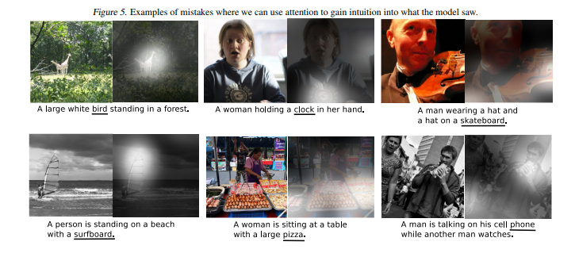

**Knowing when to look：**

自适应性的attention机制

目前大多数的基于attention机制的image captioning模型采用的都是encoder-decoder的框架。然而在decode的时候，decoder应该对不同的词有不同的attention策略。例如，”the”、”of”等词，或者是跟在”cell”后面的”phone”等组合词，这类词叫做非视觉词（non-visual word），更多依赖的是语义信息而不是视觉信息。而且，在生成caption的过程中，非视觉词的梯度会误导或者降低视觉信息的有效性。因此，本文提出了带有视觉标记的自适应的attention模型（adative attention model with a visual sentinel），在每一个time step，模型决定更依赖于图像还是visual sentinel。其中，visual sentinel存放了decoder已经知道的信息。

Lu, Jiasen, et al. "Knowing When to Look: Adaptive Attention via A Visual Sentinel for Image Captioning." (2016):3242-3250.

本文的贡献在于

1. 提出了带有视觉标记的自适应的attention模型
2. 提出了新的spatial attention机制
3. 提出了LSTM的扩展，在hidden state以外加入了一个额外的visual sentinel vector

上文 别人的笔记https://blog.csdn.net/sinat_26253653/article/details/79416234

---

### 用于卷积神经网络的注意力机制

Convolutional Block Attention Module(CBAM)

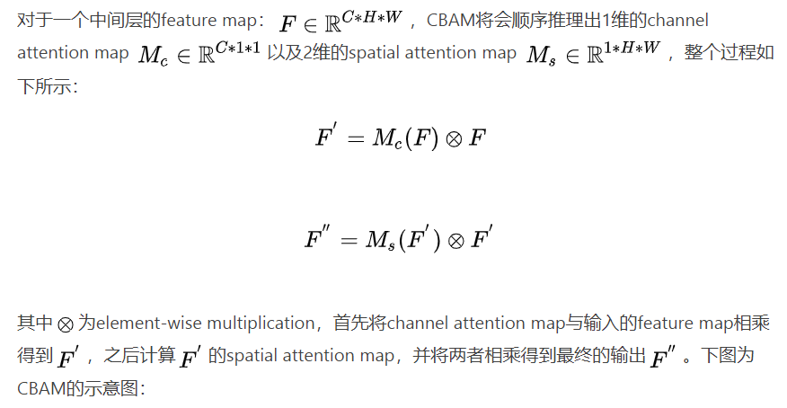

**channel attention**主要关注于输入图片中什么(**what**)是有意义的

**spatial attention**主要关注于位置信息(where)

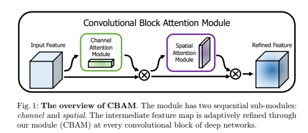

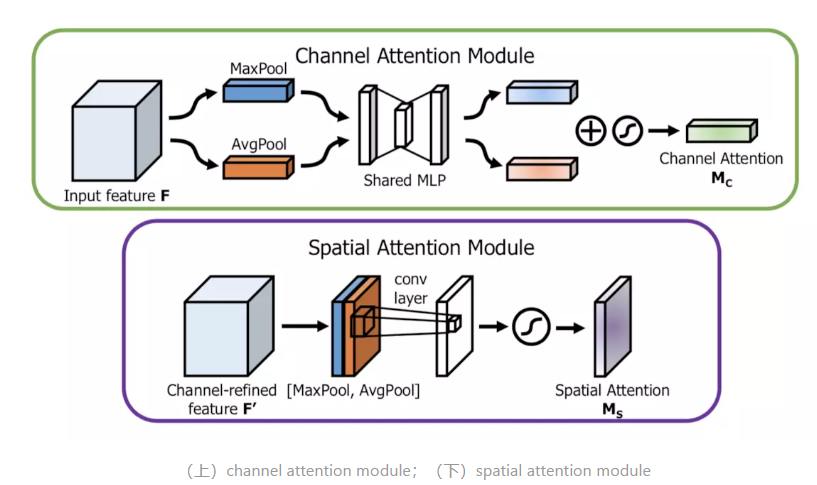

---

**SCA-CNN**

Chen, Long, et al. "SCA-CNN: Spatial and Channel-wise Attention in Convolutional Networks for Image Captioning." (2016):6298-6306.

前面所有人做的工作都是在解码器RNN上做文章，然而CNN也是不可忽略的一个重点。

文章主要是利用卷积层不同通道做attention，同时还利用了spatial attention机制，先来张图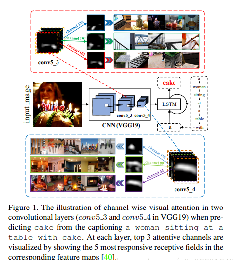

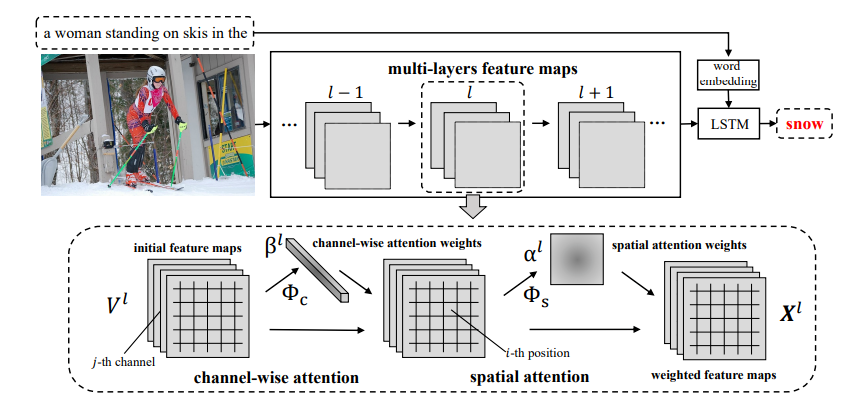

由于卷积层不同通道所代表的信息不一样，比如上图1中cake经过卷积之后，并不是在所有卷积通道中都有响应，而是在特定的通道中出现了，提取出这些特定的通道，然后用spatil attention来处理(图2中)得到最后的特征图。直观的角度来说，选取通道是决定看什么，spatial attention则是决定看哪里。最后得到的X显然比V的特征更具有纯粹性和代表性。

**Neural baby talk 和 bottom-up and top-down**

Lu, Jiasen, et al. "Neural Baby Talk." (2018).

Anderson, Peter, et al. "Bottom-Up and Top-Down Attention for Image Captioning and Visual Question Answering." (2017).

两者的共同点都是利用了object detection技术，首先提取出图像中可能的物体，再进行描述生成。

很早以前的做法所获得图像描述往往都是和图像很相关，但是不流畅。而利用深度学习之后，生成的描述变得越来越流畅，但是相关性却大打折扣。

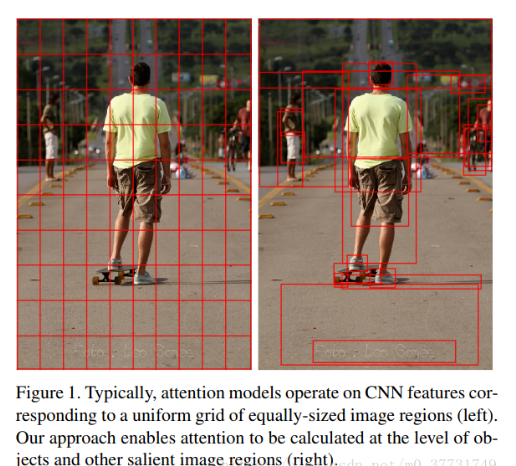

## Question

### **为什么要引入channel wise attention**

举个例子：当你要预测一张图片中的帅哥时，那么channel wise attention就会使得提取到帅哥特征的feature map的权重加大，这样最后output结果就会准确不少．

#### 为什么要引入multi-layer呢？

因为高层的feature map的生成是依赖低层的feature map的，比如你要预测图片中的帅哥，我们知道，底层网络提取到的更多是底层的细节，而高层网络才能提取到全局的语义信息，那么只有低层kernel提取到更多帅哥边缘特征，高层才能更好地抽象出帅哥来。另外如果只在最后一个卷积层做attention，其feature map的receptive field已经很大了（几乎覆盖整张图像），那么feature map之间的差异就比较小，不可避免地限制了attention的效果，所以对multi-layer的feature map做attention是非常重要的。

#### **为什么还需要spatial attention**

前面channel-wise attention 只会关注到图像的一个小部分，而spatial attention的作用为关键部分配更大的权重，让模型的注意力更集中于这部分内容。 
channel wise attention是在回答“是什么”，而spatial attention是在回答“在哪儿”． 
**spatial attention是以feature map的每个像素点为单位，对feature map的每个像素点都配一个权重值**，因此这个权重值应该是一个矩阵，大小是图片的大小；channel wise attention则是以feature map为单位，对每个channel都配一个权重值，因此这个权重值应该是一个向量。

-