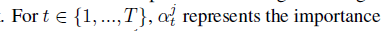
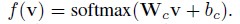

# Attend and Predict: Understanding Gene Regulation

by Selective Attention on Chromatin

参与和预测:通过选择性关注染色质来了解基因调控

过去的十年见证了基因组技术的革命，使得大量的全基因组染色质标记分析成为可能。最近的文献试图通过预测大规模染色质测量的基因表达来了解基因调控。这类学习任务存在两个基本挑战:(1)全基因组染色质信号具有空间结构、高维和高度模块化;(2)核心目标是了解相关的因素是什么以及它们是如何相互作用的。以往的研究要么未能对输入信号之间的复杂依赖关系建立模型，要么未能建立可靠性模型

### 1.引入

本文提出了一种基于注意力的深度学习结构，从数据中学习不同的染色质因子如何影响细胞中的基因表达。这种对基因调控的理解可以使我们对生命原理、疾病研究和药物开发有新的认识。

组蛋白这些会导致DNA的位置发生变化，导致DNA表达出现问题，研究人员建立了“组蛋白密码假说”，探索组蛋白修饰在控制基因调控中的作用。

与基因突变不同，组蛋白修饰等染色质改变可能是可逆的，染色质这一关键的区别使得染色质因素如何决定基因调控的理解更有影响力

处理和理解这个“大”数据仓库的根本目的是理解基因调控。**对于每种细胞类型，我们都想知道哪些染色质标记是最重要的，以及它们是如何协同控制基因表达的。**然而，之前关于这一任务的机器学习研究要么未能对标记之间的空间相关性进行建模，要么需要进行额外的特征分析来解释预测。

首先，对每个标记的信号读取都是空间结构和高维的。例如，为了量化组蛋白修饰标记的影响，学习方法通常需要使用所有覆盖长度为10的DNA区域的信号作为输入特征;000碱基对(bp) 5位于每个基因的转录起始位点(TSS)。这些信号是沿着基因组方向顺序排列的。为了开发“表观遗传”药物，重要的是要认识到染色质标记对调控的影响在不同的基因组位置上是如何变化的。

第二，人类染色质中存在各种类型的标记，这些标记可以影响基因调控。例如，五种标准组蛋白均可同时在多个不同位点进行多种化学修饰，产生大量不同的组蛋白修饰标记。**对于每一个标记，我们都构建一个特征向量来表示其周围基因TSS位置的信号。**当对从多个标记中读取的全基因组信号进行建模时，学习算法应该考虑到这些特征输入的模块化特性，其中每个标记作为一个模块。我们想了解这些模块之间的相互作用如何影响预测(基因表达)。

**在这篇论文中，我们提出了一个基于注意力的深度学习模型，即AttentiveChrome，它通过输入一个覆盖基因邻近DNA区域的组蛋白修饰信号来预测基因的表达。**通过使用多个LSTM模块的层次结构，AttentiveChrome可以发现每个染色质标记信号之间的相互作用，并同时学习不同标记之间的复杂依赖关系。**训练两种“软”注意机制:(1)注意染色质标记最相关的区域，(2)识别和注意重要的标记。**通过在一个统一的架构中预测和参与，通过在一个统一的架构中预测和参与AttentiveChrome允许用户了解染色质如何标记细胞中的控制基因调控。综上所述，本工作的贡献如下:

* AttentiveChrome provides more accurate predictions than state-of-the-art baselines. Using datasets from REMC, we evaluate AttentiveChrome on 56 different cell types (tasks).
* 我们使用相关系数来验证和比较来自REMC的新标记信号的解释分数(不用于建模)。与最先进的深度学习模型可视化方法相比，AttentiveChrome的注意力评分提供了更好的解释。
* AttentiveChrome可以对高度模块化的输入进行建模，其中每个模块都是高度结构化的。
  AttentiveChrome可以通过提供模型关注的“什么”和“哪里”来解释它的决策，这种灵活性和可解释性使该模型成为许多实际应用程序的理想方法

### 2.LSTM

​	RNNs可以捕获所建模的所有时间步骤之间的完整依赖关系集，就像序列样本中的所有空间位置一样

### 3.AttentiveChrome: A Deep Model for Joint Classification and Visualization

为了简化符号，我们使用“HM”作为术语“组蛋白修饰”的缩写。

#### 3.1Input and output formulation for the task:

我们使用与之前在**DeepChrome**([29])中相同的特性输入和输出。跟随Cheng等人。**基因表达预测被表述为一个二元分类任务，其输出表示一个基因的基因表达是高(+1)还是低(-1)。**如图1所示，一个样本(一个特定基因)的输入特征被表示为大小为$m_t$的矩阵$X$，这里$M$表示我们在输入中考虑的HM标记的数量。$T$是我们考虑的一个基因的TSS位点邻近区域在基因组上的bin位置的总数。

#### 3.2An end-to-end deep architecture for predicting and attending jointly:

AttentiveChrome学会从覆盖其基因区域的HM信号输入来预测基因的表达。首先，将每个HM标记的信号输入一个单独的LSTM网络，对其bin信号之间的空间依赖关系进行编码，然后使用另一个LSTM对多个因素如何协同工作以预测基因表达进行建模。针对每个基因，训练和动态预测两种“软”注意机制:(1)注意HM标记的最相关位置，(2)然后识别和注意相关标记。总之，AttentiveChrome由5个主要模块组成(见补充图S:2):(1)每个HM mark的bin级LSTM编码器;(2)每个HM标记的bin-level attention;(3) HM级LSTM编码器，对所有HM码进行编码;(4)HM-level关注所有HM标志;(5)最终分类模块。我们对每个组件的详细描述如下:

##### 3.2.1 Bin-Level Encoder Using LSTMs:

对于感兴趣的基因，来自$X$的第$j$行向量$x_j$包含了沿着基因组坐标顺序排列的所有$T$元素。考虑到这种信号读取的顺序性，我们将每个元素(本质上是一个存储位置)视为“时间步长”，并使用双向LSTM对$x_j$中元素之间的完全依赖关系进行建模。一个双向的LSTM包含两个LSTM，每个方向一个.

通过将这些基于lstm的HM编码器与最终的分类相结合，他们可以通过提取对预测任务至关重要的bin之间的依赖关系来学习每个嵌入的HM标记。

##### 3.2.2 Bin-Level Attention, $\alpha$-attention:

虽然LSTM可以对bin之间的依赖关系进行编码，但是很难确定哪些箱子对于从LSTM进行预测是最重要的。为了自动和自适应地突出每个样本的最相关的bin，我们使用“软”注意力来学习箱子的重要性权重。这意味着当代表第$j$个HM标记时，AttentiveChrome遵循一个基本的概念，即不是所有的bin对整个j-th HM标记的编码都有同等的贡献。注意机制可以帮助从$j -th$ HM标记中定位和识别对当前感兴趣的基因样本重要的那些bin，并可以将这些重要的bin聚合成一个嵌入向量。这种提取是通过学习第$j$个HM标记的大小为$T$的权向量$j$来实现的。

上下文参数$W_b$在训练过程中被随机初始化，并与其他模型参数共同学习。我们的想法是，通过$W_b$模型将自动地同时学习任务的上下文(例如，单元的类型)以及与上下文的位置相关性。一旦我们有每个bin-position的重要权重，我们可以表示整个$j-th$ HM标记作为所有仓位嵌入的加权和 

本质上，attention权值$\alpha_t^j$，对于当前输入$X$ ($h^j_t$和$\alpha^j_t$都依赖于$X$)，表示$m^j$中的第$t$个bin的相对重要性

##### 3.2.3 HM-Level Encoder Using Another LSTM:

我们的目标是捕获HMs之间的依赖关系，因为一些已知的HMs共同抑制或激活基因表达[6]。因此，接下来我们将对多个HM标记之间的联合依赖关系进行建模(本质上，就是学习如何表示一个集合)。即使在HMs中没有明确的顺序，我们假设一个想象的序列为$(HM_1, HM_2, HM_3,....., HM_M)$, 我们实现了另一个双向LSTM编码器，这一次在想象的序列HMs使用表示$m^j$的$j - th$ HMs作为LSTM输入

##### 3.2.4 HM-Level Attention, $\beta$-attention:

现在，我们要关注的是HM标记的重要分类基因的表达为高或低。我们通过学习第二层次的注意力来做到这一点HMs。

$HM$级上下文参数$W_s$了解任务的上下文，并了解$HMs$如何与上下文相关

$W_s$是随机初始化和联合训练的.我们将整个“基因区域”编码成一个隐藏的表示, 我们将整个“基因区域”编码成一个隐藏的表示$v$，作为所有HM标记嵌入的加权和我们可以解释学习到的$\beta^i$ 是 $HM^i$的相关重要性，当混合所有HM标记来表示当前基因样本X的整个基因区域。

##### 3.2.5 Training AttentiveChrome End-to-End:

矢量$v$概括了所有基因样本的$HMs$信息, 我们将其输入一个简单的分类模块f(补充图S:2(f))，该模块计算当前基因高表达或低表达的概率$W_c$  和 $b_c$ 是可学习的参数。由于整个模型(包括注意机制)是可微的，使用反向传播[21]进行端到端的学习是微不足道的。所有参数一起学习，以最小化负对数似然损失函数，该函数捕获真实标签y和f(:)的预测分数之间的差异。

### 4 Connecting to Previous Studies

#### 4.1 Attention-based deep models:

深度学习中注意力的概念源于人类视觉系统的特性。当我们感知一个场景时，人类的视觉更重视一些区域而不是其他[9]。这种对“注意力”的适应使得深度学习模型可以选择性地只关注重要的特征。基于注意机制的深度神经网络在机器翻译[4]、目标识别等多个研究领域取得了巨大的成功[2,26]，图像字幕生成[33]，问答[30]，文本文档分类[34]，视频描述生成]，可视化问题回答-[32]，或求解离散优化[31]。**注意力带来两个好处:(1)在预测过程中，通过选择性地聚焦于输入部分，注意力机制可以减少与深度学习模型相关的计算量和参数数量[2,26]。(2)基于注意力的建模可以根据需要动态学习显著特征[34]，有助于提高准确率。**

文献中提出了不同的注意机制，包括“软”注意力[4]，‘硬’注意力[33,24]，或‘位置感知’[8]。软注意[4]计算一个“软”加权方案的所有组成特征向量的输入。然后使用这些权重计算候选特征向量的加权组合。注意权值的大小与相应的分量特征向量对预测的显著性程度高度相关。受[34]的启发，**AttentiveChrome使用两个层次的软注意来预测HM标记的基因表达**

#### 4.2 Visualizing and understanding deep models:

虽然深度学习模型已经被证明是非常准确的，但它们被广泛视为“黑匣子”。研究人员试图开发单独的可视化技术来解释深度分类器的决策。

#### 4.3 Deep learning in bioinformatics:

深度学习在生物信息学领域越来越受欢迎。这一趋势归功于从大型数据集中提取有意义的表示的能力。例如，最近的多项研究已经成功地将深度学习用于蛋白质序列建模[23,37]和DNA序列建模[1,20]，预测基因表达[29]，以及了解非编码变异的影响[38,27]。

#### 4.4 Previous machine learning models for predicting gene expression from histone modification marks

已经提出了多种机器学习方法来预测组蛋白修饰数据的基因表达(Dong等人调查了[11])，包括线性回归[14]、支持向量机[7]、随机森林[10]、基于规则的学习[12]和CNNs[29]。这些策略各不相同，从使用所有相关位置的平均信号，到选择与目标基因表达相关性最高的输入信号的“最佳位置”策略，再到使用CNN(称为DeepChrome[29])自动学习组蛋白修饰标记之间的组合交互。DeepChrome的表现优于之前的所有方法(参见补充)，并使用基于类优化的技术来可视化所学习的模型。但是，这种类级可视化缺乏必要的粒度来理解信号

表1比较了之前关于同一任务的学习研究和AttentiveChrome在七个理想的模型属性上的结果。列显示属性(1)研究是否有一个统一的端到端体系结构,(2)如果它捕获之间的非线性特性,(3)本信息是如何被整合,(4)如果表示的特性建模在本地和全球尺度(5),(6)基因表达的预测是否提供,(7)如果组合组蛋白修饰之间的交互建模,最后(8)如果模型是解释。AttentiveChrome是唯一一个同时具备所有七个特性的模型。此外，第5节比较了AttentiveChrome的注意力权重与“显著性图”和“类优化”的可视化结果。通过对REMC中一个HM标记的相关性分析，我们发现AttentiveChrome提供了更好的解释和验证。

### 5 Experiments and Results

#### 5.1 Dataset:

 在DeepChrome[29]之后，我们下载了REMC数据库[18]存档的56种不同细胞类型的5个核心HM标记的基因表达水平和信号数据。每个数据集都包含关于整个基因组标记的位置和信号强度的信息。在REMC的[18]研究中，所有56种细胞类型的HM标记均被统一分析。这五个HM标记包括(我们在我们的分析中为可读性重新命名):$H3K27me3$为$H_{reprA}$, $H3K36me3$为$H_{struct}$, $H3K4me1$为$H_{enhc}$, $H3K4me3$为$H_{prom}$, $H3K9me3$为$H_{reprB}$。$H_{reprA}$和$H_{reprB}$被认为可以抑制基因表达，$H_{prom}$激活基因表达，$H_{struct}$在基因体上被发现，而$H_{enhc}$有时可以帮助激活基因表达。

#### 5.2 Details of the Dataset:

我们除以10;000碱基对的DNA区域(+ / -5000 碱基对)在每个基因的转录起始站点(TSS)进入bins,每个bin包含100个连续碱基对)。对于特定细胞类型中的每个基因，特征生成过程生成一个$5$X$100$矩阵X，其中列表示T(= 100)不同的bins，行表示M(= 5) HMs。对于每一种细胞类型，人类基因组中所有注释基因的基因表达均已量化并已标准化。如前所述，我们将基因表达预测任务描述为一个二元分类任务。在之后，我们使用特定细胞类型的所有基因的中位基因表达作为阈值来离散表达值。对于每种细胞类型，我们将19,802个基因样本分成三个独立但大小相同的折叠，分别用于训练(6601个基因)、验证(6601个基因)和测试(6600个基因)。

#### 5.3 Model Variations and Two Baselines:

在第3节中，我们介绍了attention技术:处理从HM标记预测基因表达的任务:LSTMs、注意机制和分级注意。为了研究这些组件的性能，我们的实验比较了多个AttentiveChrome模型变化和两个标准基线。

我们使用横跨56个单元类型的数据集，比较上面的方法和56个不同的任务。

#### 5.4 Model Hyperparameters:

对于AttentiveChrome变化，我们将bin-level LSTM嵌入大小$d$设置为32,$hm$级LSTM嵌入大小为16。因为我们实现了双向,这导致每个嵌入向量$h_t$大小为64，嵌入向量$m_j$大小为32。因此，我们将上下文向量$W_b$和$W_s$分别设置为64和32。

#### 5.5 Performance Evaluation:

比较了AttentiveChrome的不同变化,用summarized AUC scores在测试集上的56种细胞类型中得分，我们发现，总体而言，基于LSTM-注意力的模型比基于cnn和LSTM的基线表现得更好，cnn -注意力模型表现最差。我们假设最大池的缺乏是其性能低下的原因。LSTM-$\alpha$ 比LSTM-$\alpha, \beta$ .有更好的性能。我们建议用 LSTM-attention,此外，尽管DeepChrome[29]的性能改进不大，但AttentiveChrome更好，因为它允许对“黑盒”神经网络进行解释。

#### 5.6 Using Attention Scores for Interpretation:

与图片和文字不同的是，生物学的结果很难仅仅通过观察来解释。因此，我们使用了来自REMC的额外证据，并引入了一种新的策略来定性和定量地评估bin-level注意力权重或 $\alpha$ -map LSTM-模型和AttentiveChrome。为了特别验证模型是否将注意力集中在正确的bins上，我们使用了一个新的HM信号的读计数——来自REMC数据库的H3K27ac。我们把这个HM表示为$H_{active}$，因为这个HM标记了基因“打开”时活跃的区域。H3K27ac是一个重要的指标.我们没有将H3K27ac标记作为输入，因为我们用于预测的56种细胞类型都没有对其进行分析。然而，这种HM标记的全基因组读值适用于血液谱系中的三种重要细胞类型:H1-hESC(干细胞)、GM12878(血细胞)和K562(白血病细胞)。因此，我们选择比较和验证这三种细胞类型的解释。这个HM信号在模型训练或测试的任何阶段都没有被使用。我们只使用它来分析可视化结果。

###  6 Conclusion

我们提出了AttentiveChrome，这是一种基于注意力的深度学习方法，可以在一个架构中处理预测和理解。这项工作的优点包括:

* AttentiveChrome提供了比最先进的基线更准确的预测 

* AttentiveChrome的注意力得分提供了比显著性图和类优化更好的解释 

* AttentiveChrome可以对高度模块化的特性输入进行建模，其中每个特性都是按顺序构造的。

* AttentiveChrome是首个用于理解基因调控数据的深度注意机制的实现。通过定位AttentiveChrome关注的“什么”和“哪里”，我们可以获得真知灼见并理解预测(图2)。