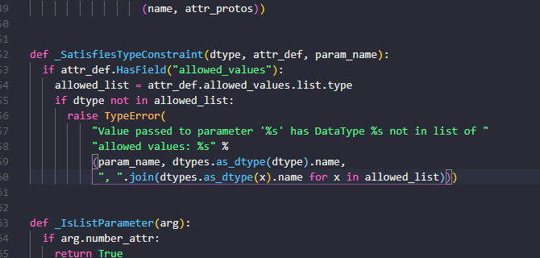

https://www.jianshu.com/p/a0a87ba6ef12

 源代码更改， 原来那么写报错


1.

错误：

```python
>>> import mujoco_py                                                                             
    raise error.MujocoDependencyError('To use MuJoCo, you need to either populate ~/.mujoco/mjkey.txt and ~/.mujoco/mjpro131, or set the MUJOCO_PY_MJKEY_PATH and MUJOCO_PY_MJPRO_PATH environment variables appropriately. Follow the instructions on https://github.com/openai/mujoco-py for where to obtain these.')                      
mujoco_py.error.MujocoDependencyError: To use MuJoCo, you need to either populate ~/.mujoco/mjkey.txt and ~/.mujoco/mjpro131, or set the MUJOCO_PY_MJKEY_PATH and MUJOCO_PY_MJPRO_PATH environment variables appropriately. Follow the instructions on https://github.com/openai/mujoco-py for where to obtain these.                                                                                                   
```

解决


2.

```ruby
Traceback (most recent call last):                                                                            
  File "<stdin>", line 1, in <module>                                                                         
  File "C:\anaconda3\envs\cs294hw1\lib\site-packages\mujoco_py\__init__.py", line 4, in <module>              
    from .mjviewer import MjViewer                                                                            
  File "C:\anaconda3\envs\cs294hw1\lib\site-packages\mujoco_py\mjviewer.py", line 7, in <module>              
    from . import mjcore, mjconstants, glfw                                                                   
  File "C:\anaconda3\envs\cs294hw1\lib\site-packages\mujoco_py\mjcore.py", line 6, in <module>                
    from .mjlib import mjlib                                                                                  
  File "C:\anaconda3\envs\cs294hw1\lib\site-packages\mujoco_py\mjlib.py", line 21, in <module>                
    mjlib = cdll.LoadLibrary(os.path.abspath(libfile))                                                        
  File "C:\anaconda3\envs\cs294hw1\lib\ctypes\__init__.py", line 426, in LoadLibrary                          
    return self._dlltype(name)                                                                                
  File "C:\anaconda3\envs\cs294hw1\lib\ctypes\__init__.py", line 348, in __init__                             
    self._handle = _dlopen(self._name, mode)                                                                  
OSError: [WinError 193] %1 不是有效的 Win32 应用程序。   
```

https://stackoverflow.com/questions/38766267/python-binding-for-mujoco-physics-library-using-mujoco-py-package


3.


PATH=C:\Users\28172\Desktop\mujoco\mjpro131\bin


4.


5.


6.

我索性就不用pip install 'gym[mujoco]'

直接下github的官方gym ，手动下

下好后，调代码，把python2.7的一些东西，包的调用添加好

调好后出现以下问题


更改


7.


把版本改成0.7.4

8.


windows 命名限制


把 time 相关的去掉


9.


pip3 install lxml

不加3 还不行 （有点奇怪 ） 下了还是没得用


这么就好了


10.


改成 items


11.

吐了 又是这些问题


12.

Making new env: CentipedeSix-v1
w library wasn't compiled to use SSE instructions, but these are available on your machine and could speed up CPU computations.

```
在main函数加这些
import os
os.environ['TF_CPP_MIN_LOG_LEVEL']='2'
import tensorflow as tf
```


13.又是windows 命名错误


success


一番努力终于调通


不过用他那个train 又出错了

1.

python3.6 移除了itervalues  凡是遇到 iter-  的时候都删掉 iter

2.




这个其实不是问题，是TensorFlow版本的原因，在TensorFlow1.7会报错，以前的版本无影响。


发现问题


3.


确实没法了

ValueError: Shape must be rank 2 but is rank 4 for 'MLP_embedding_node_type_root/layer_0/MatMul' (op: 'MatMul') with input shapes: [?,5], [0,1075052544,0,1077936128].


顶不住， 确实， 矩阵都不对， 我怀疑这篇论文了

---


---


想使用 render

报错


