http://www.cs.toronto.edu/~tingwuwang/nervenet.html

### 1.Introduction

In this work, we propose NerveNet to explicitly model the structure of an agent, which naturally takes the form of a graph.

我们证明了NerveNet学习的策略比其他模型学习的策略更具有可转移性和可泛化性，并且即使在零概率(zero-shot setting)的情况下也能转移。 WHY?

Many RL problems feature agents with multiple dependent controllers. 像机器人这种，关节间的动作不仅仅取决于观察的东西，而且取决于其他的关节影响。

RL中以前的方法通常使用MLP来学习agent的策略。特别是，MLP将来自环境的观测结果作为输入，这些观测结果可以是当前时间实例中身体和关节的位置、速度等测量值。然后，MLP策略预测每个关节和机构将采取的行动。因此，MLP策略的任务是发现观测值之间的潜在关系。这通常会导致更长的训练时间，要求更多的agent暴露于环境中。在我们的工作中，我们的目标是利用agent的主体结构，以及这些agent中自然存在的物理依赖。

我们依赖的事实是，大多数机器人和动物的身体都有一个离散的图形结构。图的节点可能表示关节，而边表示它们之间的(物理)依赖关系。特别是，我们使用一个图神经网络来定义代理的策略，Scarselli等人(2009)，这是一个操作图结构的神经网络。由于神经系统与图形的相似性，我们将我们的模型称为NerveNet。NerveNet根据底层图结构在主体的不同部分之间传播信息，然后为每个部分输出操作。通过这样做，NerveNet可以利用代理的身体编码的结构信息，这有利于学习正确的归纳偏差，这样就不容易过度拟合。此外，NerveNet自然适合结构传输任务，因为大多数模型权值分别在节点和边缘之间共享。

RL benchmarks

OpenAI Gym

**Two types of structure transfer:**

size transfer ：

​	把小size agent学习到的policy，应用到和小size agent有共享成分的大size agents上

disability transfer：

​	把相同的agent学习到的策略应用于禁用组件的相同agent

本文的主要贡献是:利用图神经网络将先验知识引入结构，探讨了学习可转移广义特征的问题。
NerveNet允许从一种结构到另一种结构的强大转移学习，这远远超出了以前模型的能力。NerveNet也更健壮，在执行多任务学习方面更有潜力。

### 2. NERVENET

表示这个运动过程为无限边界不可计算的马尔可夫决策过程MDP。

state space or observation space as $S$ and action space as $A$.

agent 产生了stochastic policy   $\pi_\theta(a^Ts^T )$

environment 产生 reward $r(s^T, a^T)$ 

代理对象去找到趋向 expect reward 的 policy

#### 2.1 GRAPH CONSTRUCTION

现实生活中，人和动物的肢体运动可以看作树图，假设有两种节点 body 和 joint （关节节点表示两个body节点间的自由度）大腿小腿body 通过 关节 joint 连接

进一步添加 root 节点来观察agent 的更多信息，助臂夹agent中，root节点能够访问到agent目的位置 ( 没明白 )

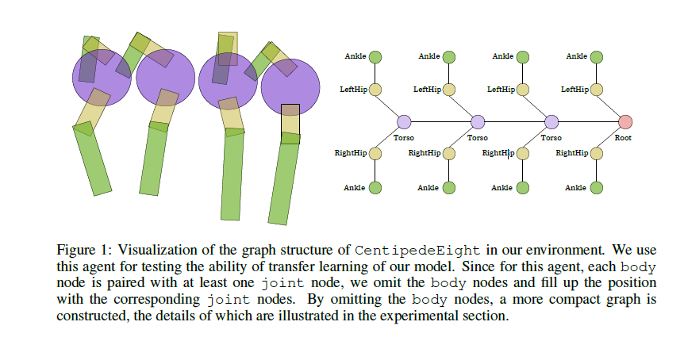

#### 2.2 NERVENET AS POLICY NETWORK

##### 	2.2.0 符号解释 :  

graph structure of the agent as $G = (V, E)$

sets of nodes $V$

sets of edges $E$

out-going neighborhood of node $u$ as $N_{out}(u)$ 

in- xxx  $N_{in}(u)$

Every node u has an associated node type $P_u$

each edge$ (u, v)$ with an edge type $ c_{(u,v)}$

节点类型可以帮助捕获跨节点的不同重要性。边缘类型可用于描述节点之间的不同关系，从而以不同的方式在节点之间传播信息,我们还可以向同一条边添加多个边缘类型，从而生成一个多重图

我们的模型中有两个关于“时间”的概念。一个是环境中的时间步长，它是RL问题的典型时间坐标， 另一个是NerveNet的内部传播步长。

在环境的每个时间步骤中，NerveNet接收来自环境的观察并执行几个内部传播步骤，以决定每个节点要采取的操作。

$\tau$   describe the time step in the environment

$t$    propagation step

##### 2.2.1 INPUT MODEL

每一个timestep $\tau$ agent 接受一个观察 $s^T$  vector

 从现在开始，为了简单起见，我们放弃环境中的时间步长，以获得模型 ( 如此简化的原因，后果？)。观测向量通过输入网络得到固定大小的状态向量如下:

$h_u^{0} = F_{in}(x_{u})$

其中下标和上标分别表示节点索引和传播步骤。在这里,
$F_{in}$可以是MLP,$h^0_u$是节点$u$在传播第0步时的状态向量。注意，如果不同的节点有不同大小的观测值，我们可能需要在观测向量上补零。

##### 2.2.2 PROPAGATION MODEL

我们现在描述了我们的NerveNet的传播模型，它模仿了分布式计算中研究的同步消息传递系统。我们将展示如何将每个节点的状态向量从一个传播步骤更新到下一个。这个更新过程在整个传播过程中递归地应用。我们把细节放在附录里。

* **Message** **Computation**

  1. 消息函数 message function 

     ​		$m^t_{(u,v)} = M_{c(u,v)}(h_u^t)$

     M 可以是多层感知机，或者单一映射，$c(u,v)$ 相同类型的边共享的相同实例，中间躯干，向两边躯干发送消息
     
  2. 消息聚集 Message Aggregation
  
     每个节点完成消息计算后，将邻近传入的消息进行聚合。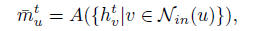
  
     $A$ 可以是 求和，平均或者 最大池化
  
  3. 状态更新 States Update
  
     现在，我们根据聚合的消息及其当前状态向量更新每个节点的状态向量。特别是对于每个节点u，我们执行如下更新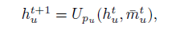
  
     其中$U$为更新函数，可以是门控递归单元(GRU)、长短时记忆单元(LSTM)或MLP。从$U$的下标 $ _{pu}$可以看出，相同节点类型的节点共享同一个更新函数实例。然后递归地对固定时间步长T应用上述传播模型，得到所有节点的最终状态向量。
  
* **OUTPUT MODEL**

在RL中，agent通常使用MLP策略，其中网络输出高斯分布的平均值每个动作的分布，而标准差是一个可训练的向量。在我们的输出模型中，我们也用同样的方法处理标准差。

但是，我们不是用一个网络预测所有动作节点的分布，而是预测单个节点的分布，我们假设我们将被分配给执行器的控制器的节点集合表示为$O$。对于每个节点，MLP以其最终状态向量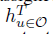作为输入，生成相应执行器的高斯策略动作的平均值，我们将其输出类型定义为$q_u$  .对于MLP$ O_{qu}$的实例可以使用不同的共享方案，例如，我们可以强制具有相似物理结构的节点共享MLP的实例。例如，在图1中，两个LeftHip节点有一个共享控制器。因此，我们有以下输出模型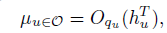

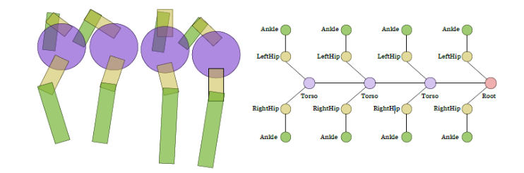

式子$\mu$表示是应用于每个执行器的动作的平均值。在实践中，我们发现可以强制不同输出类型的控制器共享一个统一的控制器，同时又不影响性能。通过对每个动作产生的高斯政策进行积分，计算出随机政策的概率密度为

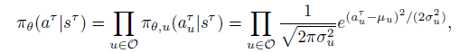

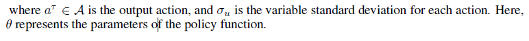

#### 2.3 LEARNING ALGORITHM

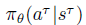agent 在多步后产生的 随机policy

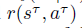 environment 产生的reward

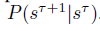 environment 到下一个状态的概率

agent 目标就是最大化累计 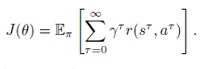

为了优化预期的奖励，我们使用了Schulman等人(2017)的proximal policy optimization (PPO)。

https://www.jianshu.com/p/9f113adc0c50

在PPO中，agent交替使用最新策略的采样轨迹，并使用采样轨迹对agent目标进行优化。该算法试图将新policy和旧policy的kl散度保持在信任区域内。为达到这一目的, PPO去掉了概率比，并在损失中加入了一个KL-divergence惩罚项。似然比定义为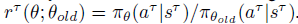 根据PPO的符号和算法，我们尽力把Ep上的loss之和减到最小。KL-penalty和value function loss定义为: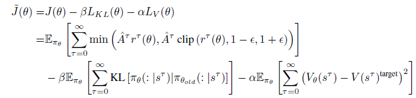 

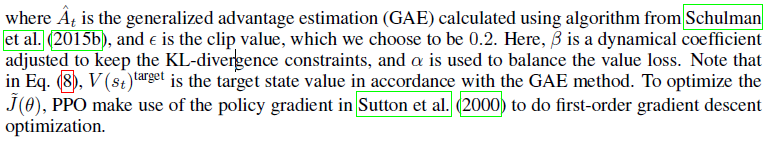

**Value Network**  

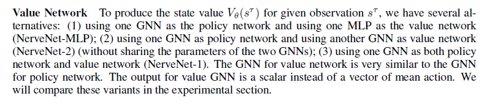

### 3 RELATED WORK

**Reinforcement Learning**

**Structure in RL**

Most approaches that exploit priors on structure of the problem fall in the domain of hierarchical RL,which mainly focus on modeling intrinsic（内在） motivation of agents. The authors extend the deep RL algorithms to MDPS with parameterized action space by exploiting the structure of action space and bounding the action space gradients.作者使用图形来学习环境的表示。然而，这些方法仅限于简单的动力学模型问题，例如二维导航任务，因此这些问题通常通过基于模型的RL来解决，然而，对于复杂的多关节智能体，动态模型的学习和状态转换的预测是费时且有偏差的。针对复杂物理环境下无模型多关节agent的训练问题，对多关节agent物理结构的建模研究相对较少

**Graph Neural Networks**

**Transfer and Multi-task Learning in RL**

### 4 EXPERIMENTS

OpenAI gym

#### 4.1 COMPARISON ON STANDARD BENCHMARKS OF MUJOCO

**Baselines** 

1.  验证图模型的重要性

   我们首先删除物理图结构，并引入一个额外的超节点来连接图中的所有节点。我们把这个基线称为TreeNet。TreeNet的传播模型类似于NerveNet，但是，策略首先聚合来自**所有**子节点的信息，然后将根节点的状态向量提供给输出模型 

#### 4.2 STRUCTURE TRANSFER LEARNING

two types of structure transfer learning tasks： 小型训练和残疾训练

* The first one is to train a model with an agent of small size (small graph) and apply the learned model to an agent with a larger size, i.e., size transfer。

  ​	图增大，action 和 observation 也同样增大

* disability model

蜈蚣（Centipede）模型： 连续躯干（torso）模型 ，对于每两个躯干，我们添加两个actuators（驱动器）作为驱动旋转，（每条腿有thigh and shin  大小腿，被中枢驱动器控制），创建了不同的agent， 4足和40足的。

NerveNet model

reuse the weights of the corresponding joints from the small-agent model.

reuse the weights from the first hidden layer to the output layer and randomly initialize the weights of the new input layer.

#### 4.3 MULTI-TASK LEARNING

NerveNet For NerveNet, the weights are naturally shared among different agents. More specifically,
for different agents, the weight matrices for propagation and output are shared.

当从单任务学习切换到多任务学习时，MLP的性能急剧下降(下降42%)，而NerveNet的性能没有明显下降。我们的直觉是NerveNet更善于学习广义特征，学习不同的agent可以帮助训练其他agent，而对于MLP方法，由于不同agent的竞争，性能下降

#### 4.4 ROBUSTNESS OF LEARNT POLICIES

We perturb the mass of the geometries (rigid bodies) in MuJoCo as well as the scale of the forces of
the joints.