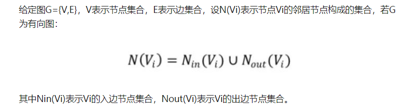

https://arxiv.org/pdf/1901.00596.pdf

A Comprehensive Survey on Graph Neural Networks

* 图卷积网络（Graph Convolution Networks，GCN）
* 图注意力网络（Graph Attention Networks）
* 图自编码器（ Graph Autoencoders）
* 图生成网络（ Graph Generative Networks） 
* 图时空网络（Graph Spatial-temporal Networks）。

#### 1.图卷积网络（Graph Convolution Networks，GCN）

图和基于数据的卷积网络的最关键的差别是，基于图片数据的相当于有一个完整的空间上的位置关系，而基于图的没有。

**理解图卷积算法**

不同颜色代表不同权重:

第一步：发射（send）每一个节点将自身的特征信息经过变换后发送给邻居节点。这一步是在对节点的特征信息进行抽取变换。

第二步：接收（receive）每个节点将邻居节点的特征信息聚集起来。这一步是在对节点的局部结构信息进行融合:

第三步：变换（transform）把前面的信息聚集之后做非线性变换，增加模型的表达能力。

**图卷积神经网络具有卷积神经网络的以下性质：**

1、局部参数共享，算子是适用于每个节点（圆圈代表算子），处处共享。

2、感受域正比于层数，最开始的时候，每个节点包含了直接邻居的信息，再计算第二层时就能把邻居的邻居的信息包含进来，这样参与运算的信息就更多更充分。层数越多，感受域就更广，参与运算的信息就更多。

输入是一张图，经过一层一层计算变换，最后输出一张图

**GCN模型同样具备深度学习的三种性质：**

1、层级结构（特征一层一层抽取，一层比一层更抽象，更高级）；

2、非线性变换 （增加模型的表达能力）；

3、端对端训练（不需要再去定义任何规则，只需要给图的节点一个标记，让模型自己学习，融合特征信息和结构信息。）

**GCN四个特征：**

1、GCN 是对卷积神经网络在 graph domain 上的自然推广。

2、它能同时对节点特征信息与结构信息进行端对端学习，是目前对图数据学习任务的最佳选择。

3、图卷积适用性极广，适用于任意拓扑结构的节点与图。

4、在节点分类与边预测等任务上，在公开数据集上效果要远远优于其他方法。

**怎么使用图卷积神经网络**

感谢 https://zhuanlan.zhihu.com/c_1025445798976176128

#### GCN 与 CNN 

​	**CNN处理的图像或者视频数据中像素点（pixel）是排列成成很整齐的矩阵**（如图2所示，也就是很多论文中所提到的Euclidean Structure）

有时候，图的数据没法表示为欧拉结构

这样的网络结构（Non Euclidean Structure）就是图论中抽象意义上的拓扑图。所以，**Graph Convolutional Network中的Graph是指数学（图论）中的用顶点和边建立相应关系的拓扑图。**

那么为什么要研究GCN？原因有三：

(1)CNN无法处理Non Euclidean Structure的数据，学术上的表达是传统的离散卷积（如问题1中所述）在Non Euclidean Structure的数据上无法保持平移不变性。通俗理解就是在拓扑图中每个顶点的相邻顶点数目都可能不同，那么当然无法用一个同样尺寸的卷积核来进行卷积运算。

(2)由于CNN无法处理Non Euclidean Structure的数据，又希望在这样的数据结构（拓扑图）上有效地提取空间特征来进行机器学习，所以GCN成为了研究的重点。

(3)读到这里大家可能会想，自己的研究问题中没有拓扑结构的网络，那是不是根本就不会用到GCN呢？其实不然，广义上来讲任何数据在赋范空间内都可以建立拓扑关联，谱聚类就是应用了这样的思想（谱聚类（spectral clustering）原理总结）。所以说拓扑连接是一种广义的数据结构，GCN有很大的应用空间。

综上所述，GCN是要为除CV、NLP之外的任务提供一种处理、研究的模型。

#### **所以GNN学的是什么**

我们首先来看图的节点作用。

**一是每个节点都有自己的特征信息。**比如针对上图，我们建立一个风控规则，要看这个用户的注册地址、IP地址、交易的收货地址是否一样，如果这些特征信息不匹配，那么系统就会判定这个用户就存在一定的欺诈风险。这是对图节点特征信息的应用。

**二是图谱中的每个节点还具有结构信息。**如果某段时间某个IP节点连接的交易节点非常多，也就是说从某个IP节点延伸出来的边非常多，那么风控系统会判定这个IP地址存在风险。这是对图节点结构信息的应用。

总的来说，在图数据里面，我们要同时考虑到节点的特征信息以及结构信息，如果靠手工规则来提取，必将失去很多隐蔽和复杂的模式，那么有没有一种方法能**自动化地同时学到图的特征信息与结构信息**呢？——图卷积神经网络

**图卷积算子**

$h_i^{l+1}  =  \sigma(\sum\limits_{j\in N_{i}}\frac{1}{c_{ij}}h_{j}^{i}w_{R_j}^{l})$

$h_i^{j}$ 节点 $i$ 在第 $l$ 层的特征表达

$c_ij$ 归一化因子，比如取节点度的倒数

$N_i$ 节点 $i$ 的邻居，包含自身

$R_i$ 节点 $i$ 的类型

$W_{R_i}$ 表示$R_i$ 类型节点的变换权重参数

**在构建一个具体业务场景的图时，标识上节点类型与边的类型，这样的图我们称之为图的结构表示（Graph Schema），它反应出来的是一种业务上的逻辑抽取**

#### 使用图的好处

**一是顺藤摸瓜，给定一个节点，顺着其边的信息，能够快速的找到它的邻居节点。**换言之，在图里面查询信息很容易。

**二是拉帮结派，由于图的传播性强（邻居的邻居也跟自己关系紧密），相互之间联系紧密的节点可以构成一个子图（或子团）。**

#### 显示场景下的图

**社交网络**、 **pageRank** 、**商品推荐**、 **推荐系统（下图为可解释性推荐）**、**知识图谱（知识推理、语义理解、智能问答）**、**风险控制（关联识别Identity recognition、聚类识别、推到识别）**、

#### 归纳总结：图的学习任务分类

上面和大家介绍的是一些常见场景下的图结构以及相关任务，总的来说，我们可以从节点、边、图三个方面对图学习任务进行分类。

1、节点上的任务：利用图中节点的关系可以做包括分类（比如风险识别、价值排名等任务）、聚类（社群检测、用户画像等任务）。

2、边上的任务：通过图中节点之间是否有边可以做比如推荐、知识推理等任务。

3、图上的任务：图可以做像高分子分类、3D视觉分类等任务。

在后期专栏中将会对各种任务进行更加细致的探讨。图在各种场景数据中都有着广泛的适用性。**但是实际应用上，图的学习一直停留在“规则引擎”、“图计算”这样的浅层层面上**

# 《Graph Learning》| 图传播算法（上）

对 Vi 节点衡量指标 Rvi 

**a.** **f是无参的**，就是说f是直接进行量化计算的，不需要参数学习过程。这样的特点就决定了f的设计需要十分精巧，符合一定的基本经验直觉，总结来说就是：

**b.** **f是作用在节点一阶邻域上的**。这一点是很多以节点为中心的算法的共同特点，每一次节点在更新过程中，只有邻居节点参与运算，但是随着更新次数的增加，信息的流通也变得更Global。

另外，停止条件一般选取一个最大的迭代轮数或者Rvi不再变化。

一般4个图传播算法 **pageRank** ,  **HITS**,**Weisfeiler-Lehman** ,**RVE2**

#### 1.PageRank

1.写邻接矩阵

2.对列做归一化

3. 作为概率

4. 假设排名
5. 

问题 

1.DeadEnds: 

​		

2. Spider traps:
   

   

因为 R4 一开始初始化为 (0.25,0.25,0.25,0.25) , 总是到4的时候还是走往4 ，所以R4会越来越趋向于1，其他的趋向于0，在实际应用中，为了有效避免上述两个问题，会使用到一个小技巧，就是假设每个节点都有一个假想的外链指向其它任一节点，这样整个图就变成了一个强连通图了。当然，为了尽量不影响最终计算的PageRank值，节点通过假想外链传递的PageRank值会乘一个权重因子β，β一般取0.2或者更小。因此，实际中PageRank的更新公式变成了：

这么就会得到一个合理的排名值了.

#### 2.Hyperlink - Induced Topic Search

1. 被越多的hub页面所指向的页面，内容质量越高。

2. 一个hub页面会尽可能地指向更高质量的内容页面。

   更新函数
   

#### 3.Weisfeiler-Lehman

Weisfeiler-Lehman算法通常被用在解决图的相似性问题上，虽然算法要解决的问题聚焦在Graph层面上，但是其立足点还是在节点上，**如果我们能够找到一种衡量节点独立性（unique）的方法，那么我们就可以将图视作一个包含这些独立性节点的集合，两张图的相似性可以转化为两个集合的Jaccard相似度。**

一个节点同时具有attribute和structure的信息，需要同时从这两方面来对节点作Identifaction。

很自然地，structure信息还是通过节点的邻居来刻画，Identifaction可以通过hashing来高效判断。如果设Φ(vi)表示节点vi的特征信息（attribute），那么更新函数可量化为：

